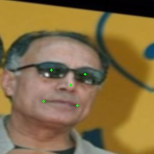
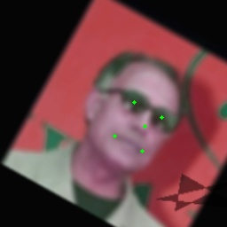

    

<div align='center'>
  
  
  
  
  
  
</div>   
<p align="center">English | <a href="docs/api/transforms.md">中文文档</a></p>


## 🤗 Introduction
**torchlm** is a PyTorch landmarks-only library with **100+ data augmentations**, support **training** and **inference**. **torchlm** is aims at only focus on any landmark detection, such as face landmarks. It provides **30+** native data augmentations and can **bind** with **80+** transforms from torchvision and albumentations with **one-line-code** style. **torchlm** also support **training** and **inference** of some awesome models for face landmarks detection, such as YOLOX, YOLOv5, ResNet, MobileNet, ShuffleNet and PIPNet, etc.
<div align='center'>
  
  
  
  
  
  
  
</div>  

<p align="center"> ❤️ Star 🌟👆🏻 this repo to support me if it does any helps to you, thanks ~  </p>


# 🆕 What's New
* [2022/03/08]: Add **PIPNet**: [Towards Efficient Facial Landmark Detection in the Wild, CVPR2021](https://github.com/jhb86253817/PIPNet)
* [2022/02/13]: Add **30+** native data augmentations and **bind** **80+** transforms from torchvision and albumentations.

## 🛠️ Usage

### Requirements
* opencv-python-headless>=4.5.2
* numpy>=1.14.4
* torch>=1.6.0
* torchvision>=0.8.0
* albumentations>=1.1.0
* onnx>=1.8.0
* onnxruntime>=1.7.0
* tqdm>=4.10.0

### Installation
you can install **torchlm** directly from [pypi](https://pypi.org/project/torchlm/). See [NOTE](#torchlm-NOTE) before installation!!!
```shell
pip3 install torchlm
# install from specific pypi mirrors use '-i'
pip3 install torchlm -i https://pypi.org/simple/
```
or install from source if you want the latest torchlm and install it in editable mode with `-e`.
```shell
# clone torchlm repository locally if you want the latest torchlm
git clone --depth=1 https://github.com/DefTruth/torchlm.git 
cd torchlm
# install in editable mode
pip install -e .
```
<div id="torchlm-NOTE"></div>  

**NOTE**: If you have the conflict problem between different installed version of opencv (opencv-python and opencv-python-headless, `ablumentations` need opencv-python-headless). Please uninstall the opencv-python and opencv-python-headless first, and then reinstall torchlm. See [albumentations#1139](https://github.com/albumentations-team/albumentations/issues/1139) for more details.

```shell
# first uninstall confilct opencvs
pip uninstall opencv-python
pip uninstall opencv-python-headless
pip uninstall torchlm  # if you have installed torchlm
# then reinstall torchlm
pip install torchlm # will also install deps, e.g opencv
```

### Data Augmentation
**torchlm** provides **30+** native data augmentations for landmarks and can **bind** with **80+** transforms from torchvision and albumentations through **torchlm.bind** method. Further, **torchlm.bind** provide a `prob` param at bind-level to force any transform or callable be a random-style augmentation. The data augmentations in **torchlm** are `safe` and `simplest`. Any transform operations at runtime cause landmarks outside will be auto dropped to keep the number of landmarks unchanged. The layout format of landmarks is `xy` with shape `(N, 2)`, `N` denotes the number of the input landmarks. No matter the input is a np.ndarray or a torch Tensor, **torchlm** will automatically be compatible with different data types and then wrap it back to the original type through a **autodtype** wrapper. 

* use almost **30+** native transforms from **torchlm** directly
```python
import torchlm
transform = torchlm.LandmarksCompose([
    torchlm.LandmarksRandomScale(prob=0.5),
    torchlm.LandmarksRandomMask(prob=0.5),
    torchlm.LandmarksRandomBlur(kernel_range=(5, 25), prob=0.5),
    torchlm.LandmarksRandomBrightness(prob=0.),
    torchlm.LandmarksRandomRotate(40, prob=0.5, bins=8),
    torchlm.LandmarksRandomCenterCrop((0.5, 1.0), (0.5, 1.0), prob=0.5)
])
```  
<div align='center'>
  
  
  
  
  
  
  
</div>  

* **bind** **80+** torchvision and albumentations's transforms through **torchlm.bind**
```python
transform = torchlm.LandmarksCompose([
    torchlm.bind(torchvision.transforms.GaussianBlur(kernel_size=(5, 25)), prob=0.5),  
    torchlm.bind(albumentations.ColorJitter(p=0.5))
])
```
See [transforms.md](docs/api/transforms.md) for supported transforms sets and more example can be found at [test/transforms.py](test/transforms.py).

<details>
<summary> bind custom callable array or Tensor functions through torchlm.bind </summary>  

```python
# First, defined your custom functions
def callable_array_noop(img: np.ndarray, landmarks: np.ndarray) -> Tuple[np.ndarray, np.ndarray]: # do some transform here ...
    return img.astype(np.uint32), landmarks.astype(np.float32)

def callable_tensor_noop(img: Tensor, landmarks: Tensor) -> Tuple[Tensor, Tensor]: # do some transform here ...
    return img, landmarks
```

```python
# Then, bind your functions and put it into the transforms pipeline.
transform = torchlm.LandmarksCompose([
        torchlm.bind(callable_array_noop, bind_type=torchlm.BindEnum.Callable_Array),
        torchlm.bind(callable_tensor_noop, bind_type=torchlm.BindEnum.Callable_Tensor, prob=0.5)
])
```
</details>

<details>
<summary> some global debug setting for torchlm's transform </summary>  

* setup logging mode as `True` globally might help you figure out the runtime details
```python
# some global setting
torchlm.set_transforms_debug(True)
torchlm.set_transforms_logging(True)
torchlm.set_autodtype_logging(True)
```  

some detail information will show you at each runtime, the infos might look like
```shell
LandmarksRandomScale() AutoDtype Info: AutoDtypeEnum.Array_InOut
LandmarksRandomScale() Execution Flag: False
BindTorchVisionTransform(GaussianBlur())() AutoDtype Info: AutoDtypeEnum.Tensor_InOut
BindTorchVisionTransform(GaussianBlur())() Execution Flag: True
BindAlbumentationsTransform(ColorJitter())() AutoDtype Info: AutoDtypeEnum.Array_InOut
BindAlbumentationsTransform(ColorJitter())() Execution Flag: True
BindTensorCallable(callable_tensor_noop())() AutoDtype Info: AutoDtypeEnum.Tensor_InOut
BindTensorCallable(callable_tensor_noop())() Execution Flag: False
Error at LandmarksRandomTranslate() Skip, Flag: False Error Info: LandmarksRandomTranslate() have 98 input landmarks, but got 96 output landmarks!
LandmarksRandomTranslate() Execution Flag: False
```
* Execution Flag: True means current transform was executed successful, False means it was not executed because of the random probability or some Runtime Exceptions(torchlm will should the error infos if debug mode is True).
* AutoDtype Info: 
  * Array_InOut means current transform need a np.ndnarray as input and then output a np.ndarray.
  * Tensor_InOut means current transform need a torch Tensor as input and then output a torch Tensor. 
  * Array_In means current transform needs a np.ndarray input and then output a torch Tensor. 
  * Tensor_In means current transform needs a torch Tensor input and then output a np.ndarray. 
    
  But, is ok if you pass a Tensor to a np.ndarray-like transform, **torchlm** will automatically be compatible with different data types and then wrap it back to the original type through a **autodtype** wrapper.

</details>


### Training
In **torchlm**, each model have a high level and user-friendly API named `training`, here is a example of [PIPNet](https://github.com/jhb86253817/PIPNet).
```python
from torchlm.models import pipnet

model = pipnet(
        backbone="resnet18",
        pretrained=False,
        num_nb=10,
        num_lms=98,
        net_stride=32,
        input_size=256,
        meanface_type="wflw",
        backbone_pretrained=True,
        map_location="cuda",
        checkpoint=None
)

model.training(
        self,
        annotation_path: str,
        criterion_cls: nn.Module = nn.MSELoss(),
        criterion_reg: nn.Module = nn.L1Loss(),
        learning_rate: float = 0.0001,
        cls_loss_weight: float = 10.,
        reg_loss_weight: float = 1.,
        num_nb: int = 10,
        num_epochs: int = 60,
        save_dir: Optional[str] = "./save",
        save_interval: Optional[int] = 10,
        save_prefix: Optional[str] = "",
        decay_steps: Optional[List[int]] = (30, 50),
        decay_gamma: Optional[float] = 0.1,
        device: Optional[Union[str, torch.device]] = "cuda",
        transform: Optional[transforms.LandmarksCompose] = None,
        coordinates_already_normalized: Optional[bool] = False,
        **kwargs: Any  # params for DataLoader
) -> nn.Module:
```
Please jump to the entry point of the function for the detail documentations of **training** API for each defined models in torchlm, e.g [pipnet/_impls.py#L159](https://github.com/DefTruth/torchlm/blob/main/torchlm/models/pipnet/_impls.py#L159). Further, the model implementation plan is as follows:

❔ YOLOX ❔ YOLOv5 ❔ NanoDet ✅ [PIPNet](https://github.com/jhb86253817/PIPNet) ❔ ResNet ❔ MobileNet ❔ ShuffleNet ❔...

✅ = known work and official supported, ❔ = in my plan, but not coming soon.

### Inference
#### C++ API
The ONNXRuntime(CPU/GPU), MNN, NCNN and TNN C++ inference of **torchlm** will be release at [lite.ai.toolkit](https://github.com/DefTruth/lite.ai.toolkit).
#### Python API
In **torchlm**, we offer a high level API named `torchlm.runtime.bind` to bind any models in torchlm and then you can run the `torchlm.runtime.forward` API to get the output of detected landmarks and bboxes, here is a example of [PIPNet](https://github.com/jhb86253817/PIPNet).
```python
import cv2
import torchlm
from torchlm.tools import faceboxesv2
from torchlm.models import pipnet

def test_pipnet_runtime():
    img_path = "./1.jpg"
    save_path = "./1.jpg"
    checkpoint = "./pipnet_resnet18_10x98x32x256_wflw.pth"
    image = cv2.imread(img_path)

    torchlm.runtime.bind(faceboxesv2())
    torchlm.runtime.bind(
        pipnet(
            backbone="resnet18",
            pretrained=True,
            num_nb=10,
            num_lms=98,
            net_stride=32,
            input_size=256,
            meanface_type="wflw",
            backbone_pretrained=True,
            map_location="cpu",
            checkpoint=checkpoint
        )
    )
    landmarks, bboxes = torchlm.runtime.forward(image)
    image = torchlm.utils.draw_bboxes(image, bboxes=bboxes)
    image = torchlm.utils.draw_landmarks(image, landmarks=landmarks)

    cv2.imwrite(save_path, image)
```
<div align='center'>
  
  
  
  
</div>  

## 📖 Documentations
* [x] [Data Augmentation's API](docs/api/transforms.md) 

## 🎓 License 
The code of **torchlm** is released under the MIT License.

## ❤️ Contribution
Please consider ⭐ this repo if you like it, as it is the simplest way to support me.

## 👋 Acknowledgement  
The implementation of torchlm's transforms borrow the code from [Paperspace](https://github.com/Paperspace/DataAugmentationForObjectDetection/blob/master/data_aug/bbox_util.py) .  
