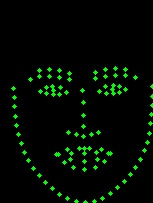

    

<div align='center'>
  
  
  
  
  
  
</div>   
<p align="center">English | <a href="docs/api/transforms.md">中文文档</a> | <a href="https://www.zhihu.com/column/c_1426666301352218624">知乎专栏</a> | <a href="https://pepy.tech/project/torchlm">下载统计</a> </p>


## 🤗 Introduction
**torchlm** is aims to build a high level pipeline for face landmarks detection, it supports **training**, **evaluating**, **exporting**, **inference(Python/C++)** and **100+ data augmentations**, can easily install with **pip**.
<div align='center'>
  
</div>  
<!---
<div align='center'>
  
  
  
  
  
  
  
</div>  
--->

<p align="center"> ❤️ Star 🌟👆🏻 this repo to support me if it does any helps to you, thanks ~  </p>

## 👋 Core Features
* High level pipeline for **training** and **inference**.
* Provides **30+** native landmarks data augmentations.
* Can **bind 80+** transforms from [torchvision](https://github.com/pytorch/vision) and [albumentations](https://github.com/albumentations-team/albumentations) with **one-line-code**.
* Support [PIPNet](https://arxiv.org/pdf/2003.03771.pdf), YOLOX, ResNet, MobileNet and ShuffleNet for face landmarks detection.

## 🆕 What's New
* [2022/03/08]: Add **PIPNet**: [Towards Efficient Facial Landmark Detection in the Wild, CVPR2021](https://github.com/jhb86253817/PIPNet)
* [2022/02/13]: Add **30+** transforms and **bind** **80+** transforms from torchvision and albumentations.

## ✅ Supported Models Matrix
✅ = known work and official supported, ❔ = in my plan, but not coming soon.

|[PIPNet](https://github.com/jhb86253817/PIPNet)|YOLOX|YOLOv5|NanoDet|ResNet|MobileNet|ShuffleNet|VIT|...|
|:---:|:---:|:---:|:---:|:---:|:---:|:---:|:---:|:---:
|✅|❔|❔|❔|❔|❔|❔|❔|❔|❔|❔|

## 🔥🔥Performance(@NME)

<div align='center'>
  
  
</div>  

|Model|Backbone|Head|300W|COFW|AFLW|WFLW|Download|
|:---:|:---:|:---:|:---:|:---:|:---:|:---:|:---:|
|PIPNet|MobileNetV2|Heatmap+Regression+NRM|3.40|3.43|1.52|4.79| [link](https://github.com/DefTruth/torchlm/releases/tag/torchlm-0.1.6-alpha)|
|PIPNet|ResNet18|Heatmap+Regression+NRM|3.36|3.31|1.48|4.47| [link](https://github.com/DefTruth/torchlm/releases/tag/torchlm-0.1.6-alpha)|
|PIPNet|ResNet50|Heatmap+Regression+NRM|3.34|3.18|1.44|4.48| [link](https://github.com/DefTruth/torchlm/releases/tag/torchlm-0.1.6-alpha)|
|PIPNet|ResNet101|Heatmap+Regression+NRM|3.19|3.08|1.42|4.31| [link](https://github.com/DefTruth/torchlm/releases/tag/torchlm-0.1.6-alpha)|


## 🛠️Installation
you can install **torchlm** directly from [pypi](https://pypi.org/project/torchlm/). 
```shell
pip install torchlm>=0.1.6.7 # or install the latest pypi version `pip install torchlm`
pip install torchlm>=0.1.6.7 -i https://pypi.org/simple/ # or install from specific pypi mirrors use '-i'
```
or install from source if you want the latest torchlm and install it in editable mode with `-e`.
```shell
git clone --depth=1 https://github.com/DefTruth/torchlm.git 
cd torchlm && pip install -e .
```
<div id="torchlm-NOTE"></div>  


## 🌟🌟Data Augmentation
**torchlm** provides **30+** native data augmentations for landmarks and can **bind** with **80+** transforms from torchvision and albumentations. The layout format of landmarks is `xy` with shape `(N, 2)`.

Use almost **30+** native transforms from **torchlm** directly
```python
import torchlm
transform = torchlm.LandmarksCompose([
    torchlm.LandmarksRandomScale(prob=0.5),
    torchlm.LandmarksRandomMask(prob=0.5),
    torchlm.LandmarksRandomBlur(kernel_range=(5, 25), prob=0.5),
    torchlm.LandmarksRandomBrightness(prob=0.),
    torchlm.LandmarksRandomRotate(40, prob=0.5, bins=8),
    torchlm.LandmarksRandomCenterCrop((0.5, 1.0), (0.5, 1.0), prob=0.5)
])
```  
<div align='center'>
  
  
  
  
  
  
  
</div>  

Also, a user-friendly API `build_default_transform` is available to build a default transform pipeline.
```python
transform = torchlm.build_default_transform(
    input_size=(input_size, input_size),
    mean=[0.485, 0.456, 0.406],
    std=[0.229, 0.224, 0.225],
    force_norm_before_mean_std=True,  # img/=255. first
    rotate=30,
    keep_aspect=False,
    to_tensor=True  # array -> Tensor & HWC -> CHW
)
```
See [transforms.md](docs/api/transforms.md) for supported transforms sets and more example can be found at [test/transforms.py](test/transforms.py).

<details>

<summary>💡 more details about transform in torchlm </summary>  

**torchlm** provides **30+** native data augmentations for landmarks and can **bind** with **80+** transforms from torchvision and albumentations through **torchlm.bind** method. The layout format of landmarks is `xy` with shape `(N, 2)`, `N` denotes the number of the input landmarks. Further, **torchlm.bind** provide a `prob` param at bind-level to force any transform or callable be a random-style augmentation. The data augmentations in **torchlm** are `safe` and `simplest`. Any transform operations at runtime cause landmarks outside will be auto dropped to keep the number of landmarks unchanged. Yes, is ok if you pass a Tensor to a np.ndarray-like transform, **torchlm** will automatically be compatible with different data types and then wrap it back to the original type through a **autodtype** wrapper. 

<details>
<summary> bind 80+ torchvision and albumentations's transforms </summary>  

**NOTE**: Please install albumentations first if you want to bind albumentations's transforms. If you have the conflict problem between different installed version of opencv (opencv-python and opencv-python-headless, `ablumentations` need opencv-python-headless). Please uninstall the opencv-python and opencv-python-headless first, and then reinstall albumentations. See [albumentations#1140](https://github.com/albumentations-team/albumentations/issues/1140) for more details.

```shell
# first uninstall conflict opencvs
pip uninstall opencv-python
pip uninstall opencv-python-headless
pip uninstall albumentations  # if you have installed albumentations
pip install albumentations # then reinstall albumentations, will also install deps, e.g opencv
```

Then, check if albumentations is available. 
```python
torchlm.albumentations_is_available()  # True or False
```

```python
transform = torchlm.LandmarksCompose([
    torchlm.bind(torchvision.transforms.GaussianBlur(kernel_size=(5, 25)), prob=0.5),  
    torchlm.bind(albumentations.ColorJitter(p=0.5))
])
```

</details>

<details>
<summary> bind custom callable array or Tensor transform functions </summary>  

```python
# First, defined your custom functions
def callable_array_noop(img: np.ndarray, landmarks: np.ndarray) -> Tuple[np.ndarray, np.ndarray]: # do some transform here ...
    return img.astype(np.uint32), landmarks.astype(np.float32)

def callable_tensor_noop(img: Tensor, landmarks: Tensor) -> Tuple[Tensor, Tensor]: # do some transform here ...
    return img, landmarks
```

```python
# Then, bind your functions and put it into the transforms pipeline.
transform = torchlm.LandmarksCompose([
        torchlm.bind(callable_array_noop, bind_type=torchlm.BindEnum.Callable_Array),
        torchlm.bind(callable_tensor_noop, bind_type=torchlm.BindEnum.Callable_Tensor, prob=0.5)
])
```
</details>

<details>
<summary> some global debug setting for torchlm's transform </summary>  

* setup logging mode as `True` globally might help you figure out the runtime details
```python
# some global setting
torchlm.set_transforms_debug(True)
torchlm.set_transforms_logging(True)
torchlm.set_autodtype_logging(True)
```  

some detail information will show you at each runtime, the infos might look like
```shell
LandmarksRandomScale() AutoDtype Info: AutoDtypeEnum.Array_InOut
LandmarksRandomScale() Execution Flag: False
BindTorchVisionTransform(GaussianBlur())() AutoDtype Info: AutoDtypeEnum.Tensor_InOut
BindTorchVisionTransform(GaussianBlur())() Execution Flag: True
BindAlbumentationsTransform(ColorJitter())() AutoDtype Info: AutoDtypeEnum.Array_InOut
BindAlbumentationsTransform(ColorJitter())() Execution Flag: True
BindTensorCallable(callable_tensor_noop())() AutoDtype Info: AutoDtypeEnum.Tensor_InOut
BindTensorCallable(callable_tensor_noop())() Execution Flag: False
Error at LandmarksRandomTranslate() Skip, Flag: False Error Info: LandmarksRandomTranslate() have 98 input landmarks, but got 96 output landmarks!
LandmarksRandomTranslate() Execution Flag: False
```
* Execution Flag: True means current transform was executed successful, False means it was not executed because of the random probability or some Runtime Exceptions(torchlm will should the error infos if debug mode is True).
* AutoDtype Info: 
  * Array_InOut means current transform need a np.ndnarray as input and then output a np.ndarray.
  * Tensor_InOut means current transform need a torch Tensor as input and then output a torch Tensor. 
  * Array_In means current transform needs a np.ndarray input and then output a torch Tensor. 
  * Tensor_In means current transform needs a torch Tensor input and then output a np.ndarray. 
    
  Yes, is ok if you pass a Tensor to a np.ndarray-like transform, **torchlm** will automatically be compatible with different data types and then wrap it back to the original type through a **autodtype** wrapper.

</details>

</details>


## 🎉🎉Training  
In **torchlm**, each model have two high level and user-friendly APIs named `apply_training` and `apply_freezing` for training. `apply_training` handle the training process and `apply_freezing` decide whether to freeze the backbone for fune-tuning.

### Quick Start👇
Here is an example of [PIPNet](https://arxiv.org/pdf/2003.03771.pdf). You can freeze backbone before fine-tuning through `apply_freezing`.

```python
from torchlm.models import pipnet
# will auto download pretrained weights from latest release if pretrained=True
model = pipnet(backbone="resnet18", pretrained=True, num_nb=10, num_lms=98, net_stride=32,
               input_size=256, meanface_type="wflw", backbone_pretrained=True)
model.apply_freezing(backbone=True)
model.apply_training(
    annotation_path="../data/WFLW/converted/train.txt",  # or fine-tuning your custom data
    num_epochs=10,
    learning_rate=0.0001,
    save_dir="./save/pipnet",
    save_prefix="pipnet-wflw-resnet18",
    save_interval=1,
    logging_interval=1,
    device="cuda",
    coordinates_already_normalized=True,
    batch_size=16,
    num_workers=4,
    shuffle=True
)
```  
Please jump to the entry point of the function for the detail documentations of **apply_training** API for each defined models in torchlm, e.g [pipnet/_impls.py#L166](https://github.com/DefTruth/torchlm/blob/main/torchlm/models/pipnet/_impls.py#L166). You might see some logs if the training process is running: 

```shell
Parameters for DataLoader:  {'batch_size': 16, 'num_workers': 4, 'shuffle': True}
Built _PIPTrainDataset: train count is 7500 !
Epoch 0/9
----------
[Epoch 0/9, Batch 1/468] <Total loss: 0.372885> <cls loss: 0.063186> <x loss: 0.078508> <y loss: 0.071679> <nbx loss: 0.086480> <nby loss: 0.073031>
[Epoch 0/9, Batch 2/468] <Total loss: 0.354169> <cls loss: 0.051672> <x loss: 0.075350> <y loss: 0.071229> <nbx loss: 0.083785> <nby loss: 0.072132>
[Epoch 0/9, Batch 3/468] <Total loss: 0.367538> <cls loss: 0.056038> <x loss: 0.078029> <y loss: 0.076432> <nbx loss: 0.083546> <nby loss: 0.073492>
[Epoch 0/9, Batch 4/468] <Total loss: 0.339656> <cls loss: 0.053631> <x loss: 0.073036> <y loss: 0.066723> <nbx loss: 0.080007> <nby loss: 0.066258>
[Epoch 0/9, Batch 5/468] <Total loss: 0.364556> <cls loss: 0.051094> <x loss: 0.077378> <y loss: 0.071951> <nbx loss: 0.086363> <nby loss: 0.077770>
[Epoch 0/9, Batch 6/468] <Total loss: 0.371356> <cls loss: 0.049117> <x loss: 0.079237> <y loss: 0.075729> <nbx loss: 0.086213> <nby loss: 0.081060>
...
[Epoch 0/9, Batch 33/468] <Total loss: 0.298983> <cls loss: 0.041368> <x loss: 0.069912> <y loss: 0.057667> <nbx loss: 0.072996> <nby loss: 0.057040>
```

### Dataset Format👇
The `annotation_path` parameter is denotes the path to a custom annotation file, the format must be:
```shell
"img0_path x0 y0 x1 y1 ... xn-1,yn-1"
"img1_path x0 y0 x1 y1 ... xn-1,yn-1"
"img2_path x0 y0 x1 y1 ... xn-1,yn-1"
"img3_path x0 y0 x1 y1 ... xn-1,yn-1"
...
```
If the label in annotation_path is already normalized by image size, please set `coordinates_already_normalized` as `True` in `apply_training` API.
```shell
"img0_path x0/w y0/h x1/w y1/h ... xn-1/w,yn-1/h"
"img1_path x0/w y0/h x1/w y1/h ... xn-1/w,yn-1/h"
"img2_path x0/w y0/h x1/w y1/h ... xn-1/w,yn-1/h"
"img3_path x0/w y0/h x1/w y1/h ... xn-1/w,yn-1/h"
...
```
Here is an example of [WFLW](torchlm/data/_converters.py) to show you how to prepare the dataset, also see [test/data.py](test/data.py).

### Additional Custom Settings👋

Some models in torchlm support additional custom settings beyond the `num_lms` of your custom dataset. For example, [PIPNet](https://arxiv.org/pdf/2003.03771.pdf) also need to set a custom meanface generated by your custom dataset. Please jump the source code of each defined model in **torchlm** for the details about additional custom settings to get more flexibilities of training or fine-tuning processes. Here is an example of How to train [PIPNet](https://arxiv.org/pdf/2003.03771.pdf) in your own dataset with custom meanface setting?

Set up your custom meanface and nearest-neighbor landmarks through `pipnet.set_custom_meanface` method, this method will calculate the Euclidean Distance between different landmarks in meanface and will auto set up the nearest-neighbors for each landmark. NOTE: The PIPNet will reshape the detection headers if the number of landmarks in custom dataset is not equal with the `num_lms` you initialized.

```python
def set_custom_meanface(custom_meanface_file_or_string: str) -> bool:
    """
    :param custom_meanface_file_or_string: a long string or a file contains normalized
    or un-normalized meanface coords, the format is "x0,y0,x1,y1,x2,y2,...,xn-1,yn-1".
    :return: status, True if successful.
    """
```
Also, a `generate_meanface` API is available in torchlm to help you get meanface in custom dataset.
```python
# generate your custom meanface.
custom_meanface, custom_meanface_string = torchlm.data.annotools.generate_meanface(
  annotation_path="../data/WFLW/converted/train.txt",
  coordinates_already_normalized=True)
# check your generated meanface.
rendered_meanface = torchlm.data.annotools.draw_meanface(
  meanface=custom_meanface, coordinates_already_normalized=True)
cv2.imwrite("./logs/wflw_meanface.jpg", rendered_meanface)
# setting up your custom meanface
model.set_custom_meanface(custom_meanface_file_or_string=custom_meanface_string)
```
<div align='center'>
  
</div>  

### Benchmarks Dataset Converters👇
In **torchlm**, some pre-defined dataset converters for common use benchmark datasets are available, such as [300W](https://ibug.doc.ic.ac.uk/resources/facial-point-annotations/), [COFW](http://www.vision.caltech.edu/xpburgos/ICCV13/), [WFLW](https://wywu.github.io/projects/LAB/WFLW.html) and [AFLW](https://www.tugraz.at/institute/icg/research/team-bischof/lrs/downloads/aflw/). These converters will help you to convert the common use dataset to the standard annotation format that **torchlm** need. Here is an example of [WFLW](https://wywu.github.io/projects/LAB/WFLW.html).  
```python
from torchlm.data import LandmarksWFLWConverter
# setup your path to the original downloaded dataset from official 
converter = LandmarksWFLWConverter(
    data_dir="../data/WFLW", save_dir="../data/WFLW/converted",
    extend=0.2, rebuild=True, target_size=256, keep_aspect=False,
    force_normalize=True, force_absolute_path=True
)
converter.convert()
converter.show(count=30)  # show you some converted images with landmarks for debugging
```
Then, the output's layout in `../data/WFLW/converted` would be look like:
```shell
├── image
│   ├── test
│   └── train
├── show
│   ├── 16--Award_Ceremony_16_Award_Ceremony_Awards_Ceremony_16_589x456y91.jpg
│   ├── 20--Family_Group_20_Family_Group_Family_Group_20_118x458y58.jpg
...
├── test.txt
└── train.txt
```

## 🛸🚵‍️ Inference
### C++ APIs👀
The ONNXRuntime(CPU/GPU), MNN, NCNN and TNN C++ inference of **torchlm** will be release in **[lite.ai.toolkit](https://github.com/DefTruth/lite.ai.toolkit)**. Here is an example of **1000 Facial Landmarks Detection** using [FaceLandmarks1000](https://github.com/Single430/FaceLandmark1000). Download model from Model-Zoo[<sup>2</sup>](https://github.com/DefTruth/lite.ai.toolkit#lite.ai.toolkit-Model-Zoo).

```C++
#include "lite/lite.h"

static void test_default()
{
  std::string onnx_path = "../../../hub/onnx/cv/FaceLandmark1000.onnx";
  std::string test_img_path = "../../../examples/lite/resources/test_lite_face_landmarks_0.png";
  std::string save_img_path = "../../../logs/test_lite_face_landmarks_1000.jpg";
    
  auto *face_landmarks_1000 = new lite::cv::face::align::FaceLandmark1000(onnx_path);

  lite::types::Landmarks landmarks;
  cv::Mat img_bgr = cv::imread(test_img_path);
  face_landmarks_1000->detect(img_bgr, landmarks);
  lite::utils::draw_landmarks_inplace(img_bgr, landmarks);
  cv::imwrite(save_img_path, img_bgr);
  
  delete face_landmarks_1000;
}
```
The output is:
<div align='center'>
  
  
  
</div>    

More classes for face alignment (68 points, 98 points, 106 points, 1000 points)
```c++
auto *align = new lite::cv::face::align::PFLD(onnx_path);  // 106 landmarks, 1.0Mb only!
auto *align = new lite::cv::face::align::PFLD98(onnx_path);  // 98 landmarks, 4.8Mb only!
auto *align = new lite::cv::face::align::PFLD68(onnx_path);  // 68 landmarks, 2.8Mb only!
auto *align = new lite::cv::face::align::MobileNetV268(onnx_path);  // 68 landmarks, 9.4Mb only!
auto *align = new lite::cv::face::align::MobileNetV2SE68(onnx_path);  // 68 landmarks, 11Mb only!
auto *align = new lite::cv::face::align::FaceLandmark1000(onnx_path);  // 1000 landmarks, 2.0Mb only!
```  
More details of C++ APIs, please check **[lite.ai.toolkit](https://github.com/DefTruth/lite.ai.toolkit)**.   

### Python APIs👇
In **torchlm**, a high level API named `runtime.bind` can bind face detection and landmarks models together, then you can run the `runtime.forward` API to get the output landmarks and bboxes, here is an example of [PIPNet](https://github.com/jhb86253817/PIPNet). Pretrained weights of PIPNet, [Download](https://github.com/DefTruth/torchlm/releases/tag/torchlm-0.1.6-alpha).
```python
import torchlm
from torchlm.tools import faceboxesv2
from torchlm.models import pipnet

torchlm.runtime.bind(faceboxesv2())
torchlm.runtime.bind(
  pipnet(backbone="resnet18", pretrained=True,  
         num_nb=10, num_lms=98, net_stride=32, input_size=256,
         meanface_type="wflw", map_location="cpu", checkpoint=None)
) # will auto download pretrained weights from latest release if pretrained=True
landmarks, bboxes = torchlm.runtime.forward(image)
image = torchlm.utils.draw_bboxes(image, bboxes=bboxes)
image = torchlm.utils.draw_landmarks(image, landmarks=landmarks)
```
<div align='center'>
  
  
</div>  

## 🤠🎯 Evaluating  
In **torchlm**, each model have a high level and user-friendly API named `apply_evaluating` for evaluation. This method will calculate the NME, FR and AUC for eval dataset. Here is an example of [PIPNet](https://github.com/jhb86253817/PIPNet).

```python
from torchlm.models import pipnet
# will auto download pretrained weights from latest release if pretrained=True
model = pipnet(backbone="resnet18", pretrained=True, num_nb=10, num_lms=98, net_stride=32,
               input_size=256, meanface_type="wflw", backbone_pretrained=True)
NME, FR, AUC = model.apply_evaluating(
    annotation_path="../data/WFLW/convertd/test.txt",
    norm_indices=[60, 72],  # the indexes of two eyeballs.
    coordinates_already_normalized=True, 
    eval_normalized_coordinates=False
)
print(f"NME: {NME}, FR: {FR}, AUC: {AUC}")
```
Then, you will get the **Performance(@NME@FR@AUC)** results.
```shell
Built _PIPEvalDataset: eval count is 2500 !
Evaluating PIPNet: 100%|██████████| 2500/2500 [02:53<00:00, 14.45it/s]
NME: 0.04453323229181989, FR: 0.04200000000000004, AUC: 0.5732673333333334
```

## ⚙️⚔️ Exporting  
In **torchlm**, each model have a high level and user-friendly API named `apply_exporting` for ONNX export. Here is an example of [PIPNet](https://github.com/jhb86253817/PIPNet).

```python
from torchlm.models import pipnet
# will auto download pretrained weights from latest release if pretrained=True
model = pipnet(backbone="resnet18", pretrained=True, num_nb=10, num_lms=98, net_stride=32,
               input_size=256, meanface_type="wflw", backbone_pretrained=True)
model.apply_exporting(
    onnx_path="./save/pipnet/pipnet_resnet18.onnx",
    opset=12, simplify=True, output_names=None  # use default output names.
)
``` 
Then, you will get a Static ONNX model file if the exporting process was done.
```shell
  ...
  %195 = Add(%259, %189)
  %196 = Relu(%195)
  %outputs_cls = Conv[dilations = [1, 1], group = 1, kernel_shape = [1, 1], pads = [0, 0, 0, 0], strides = [1, 1]](%196, %cls_layer.weight, %cls_layer.bias)
  %outputs_x = Conv[dilations = [1, 1], group = 1, kernel_shape = [1, 1], pads = [0, 0, 0, 0], strides = [1, 1]](%196, %x_layer.weight, %x_layer.bias)
  %outputs_y = Conv[dilations = [1, 1], group = 1, kernel_shape = [1, 1], pads = [0, 0, 0, 0], strides = [1, 1]](%196, %y_layer.weight, %y_layer.bias)
  %outputs_nb_x = Conv[dilations = [1, 1], group = 1, kernel_shape = [1, 1], pads = [0, 0, 0, 0], strides = [1, 1]](%196, %nb_x_layer.weight, %nb_x_layer.bias)
  %outputs_nb_y = Conv[dilations = [1, 1], group = 1, kernel_shape = [1, 1], pads = [0, 0, 0, 0], strides = [1, 1]](%196, %nb_y_layer.weight, %nb_y_layer.bias)
  return %outputs_cls, %outputs_x, %outputs_y, %outputs_nb_x, %outputs_nb_y
}
Checking 0/3...
Checking 1/3...
Checking 2/3...
```

## 📖 Documentations
* [x] [Data Augmentation's API](docs/api/transforms.md) 

## 🎓 License 
The code of **torchlm** is released under the MIT License.

## ❤️ Contribution
Please consider ⭐ this repo if you like it, as it is the simplest way to support me.

## 👋 Acknowledgement  
* The implementation of torchlm's transforms borrow the code from [Paperspace](https://github.com/Paperspace/DataAugmentationForObjectDetection/blob/master/data_aug/bbox_util.py).    
* **PIPNet**: [Towards Efficient Facial Landmark Detection in the Wild, CVPR2021](https://github.com/jhb86253817/PIPNet)
