    

<div align='center'>
  
  
  
  
  
  
</div>   


## 🤗 Introduction
**torchlm** is a PyTorch landmarks-only library with **100+ data augmentations**, **training** and **inference**. **torchlm** is only focus on any landmarks detection, such as face landmarks, hand keypoints and body keypoints, etc. It provides **30+** native data augmentations and can **bind** with **80+** transforms from torchvision and albumations, no matter the input is a np.ndarray or a torch Tensor, **torchlm** will automatically be compatible with different data types and then wrap it back to the original type through a **autodtype** wrapper. Further, **torchlm** will add modules for **training** and **inference** in the future.

# 🆕 What's New

* [2022/02/13]: Add **30+** native data augmentations and **bind** **80+** torchvision and albumations's transforms.

## 🛠️ Usage

### Requirements
* opencv-python-headless>=4.5.2
* numpy>=1.14.4
* torch>=1.6.0
* torchvision>=0.9.0
* albumentations>=1.1.0

### Installation
you can install **torchlm** directly from [pypi](https://pypi.org/project/torchlm/).
```shell
pip3 install torchlm
# install from specific pypi mirrors use '-i'
pip3 install torchlm -i https://pypi.org/simple/
```
or install from source.
```shell
# clone torchlm repository locally
git clone --depth=1 https://github.com/DefTruth/torchlm.git 
cd torchlm
# install in editable mode
pip install -e .
```

### Data Augmentation
**torchlm** provides **30+** native data augmentations for landmarks and can **bind** with **80+** transforms from torchvision and albumations **torchlm.bind** method. Further, **torchlm.bind** provide a `prob` parameter at bind-level to force any transform or callable be a random-style. The data augmentations in **torchlm** are `safe` and `simplest`. Any transform operations at runtime cause landmarks outside will be auto drop to keep the number of landmarks unchanged. The layout format of landmarks is `xy` with shape `(N, 2)`, `N` denotes the number of the input landmarks. No matter the input is a np.ndarray or a torch Tensor, **torchlm** will automatically be compatible with different data types and then wrap it back to the original type through a **autodtype** wrapper. 

* use native torchlm transforms
```python
import torchlm
transform = torchlm.LandmarksCompose([
        # use native torchlm transforms
        torchlm.LandmarksRandomScale(prob=0.5),
        torchlm.LandmarksRandomTranslate(prob=0.5),
        torchlm.LandmarksRandomShear(prob=0.5),
        torchlm.LandmarksRandomMask(prob=0.5),
        torchlm.LandmarksRandomBlur(kernel_range=(5, 25), prob=0.5),
        torchlm.LandmarksRandomBrightness(prob=0.),
        torchlm.LandmarksRandomRotate(40, prob=0.5, bins=8),
        torchlm.LandmarksRandomCenterCrop((0.5, 1.0), (0.5, 1.0), prob=0.5),
        # ...
    ])
```  
<div align='center'>
  
  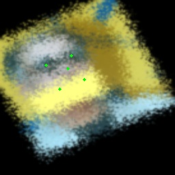
  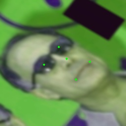
  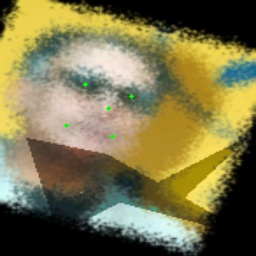
  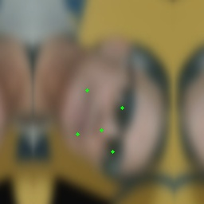
  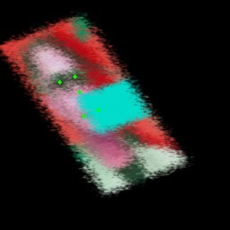
  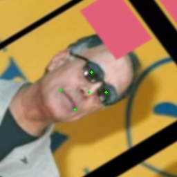
</div>  

* **bind** torchvision and albumations's transform, using **torchlm.bind**
```python
import torchvision
import albumentations
import torchlm
transform = torchlm.LandmarksCompose([
        # use native torchlm transforms
        torchlm.LandmarksRandomScale(prob=0.5),
        # bind torchvision image only transforms
        torchlm.bind(torchvision.transforms.GaussianBlur(kernel_size=(5, 25)), prob=0.5),  # bind with a given prob
        torchlm.bind(torchvision.transforms.RandomAutocontrast(p=0.5)),
        # bind albumentations image only transforms
        torchlm.bind(albumentations.ColorJitter(p=0.5)),
        torchlm.bind(albumentations.GlassBlur(p=0.5)),
        # bind albumentations dual transforms
        torchlm.bind(albumentations.RandomCrop(height=200, width=200, p=0.5)),
        torchlm.bind(albumentations.Rotate(p=0.5)),
        # ...
    ])
```
* **bind** custom callable array or Tensor functions, using **torchlm.bind**  

```python
# First, defined your custom functions
def callable_array_noop(img: np.ndarray, landmarks: np.ndarray) -> Tuple[np.ndarray, np.ndarray]:
    # do some transform here ...
    return img.astype(np.uint32), landmarks.astype(np.float32)

def callable_tensor_noop(img: Tensor, landmarks: Tensor) -> Tuple[Tensor, Tensor]:
    # do some transform here ...
    return img, landmarks
```

```python
# Then, bind your functions and put it into the transforms pipeline.
transform = torchlm.LandmarksCompose([
        # use native torchlm transforms
        torchlm.LandmarksRandomScale(prob=0.5),
        # bind custom callable array functions
        torchlm.bind(callable_array_noop, bind_type=torchlm.BindEnum.Callable_Array),
        # bind custom callable Tensor functions with a given prob
        torchlm.bind(callable_tensor_noop, bind_type=torchlm.BindEnum.Callable_Tensor, prob=0.5),  
        # ...
    ])
```
<div align='center'>
  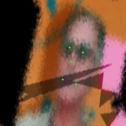
  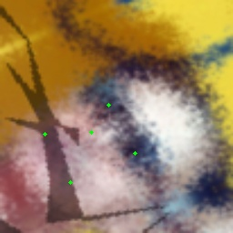
  
  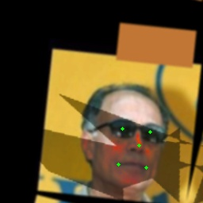
  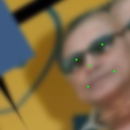
  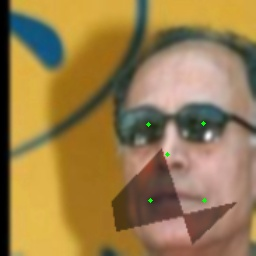
  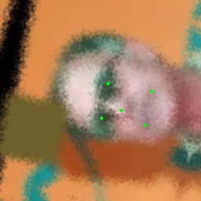
</div>  


* setup logging mode as `True` globally might help you figure out the runtime details
```python
import torchlm
# some global setting
torchlm.set_transforms_debug(True)
torchlm.set_transforms_logging(True)
torchlm.set_autodtype_logging(True)
```
some detail information will show you at each runtime, the infos might look like
```shell
LandmarksRandomScale() AutoDtype Info: AutoDtypeEnum.Array_InOut
LandmarksRandomScale() Execution Flag: False
BindTorchVisionTransform(GaussianBlur())() AutoDtype Info: AutoDtypeEnum.Tensor_InOut
BindTorchVisionTransform(GaussianBlur())() Execution Flag: True
BindAlbumentationsTransform(ColorJitter())() AutoDtype Info: AutoDtypeEnum.Array_InOut
BindAlbumentationsTransform(ColorJitter())() Execution Flag: True
BindTensorCallable(callable_tensor_noop())() AutoDtype Info: AutoDtypeEnum.Tensor_InOut
BindTensorCallable(callable_tensor_noop())() Execution Flag: False
```
* Execution Flag: True means current transform was executed successful, False means it was not executed because of the random probability or some Runtime Exceptions(torchlm will should the error infos if debug mode is True).
* AutoDtype Info: 
  * Array_InOut means current transform need a np.ndnarray as input and then output a np.ndarray.
  * Tensor_InOut means current transform need a torch Tensor as input and then output a torch Tensor. 
  * Array_In means current transform needs a np.ndarray input and then output a torch Tensor. 
  * Tensor_In means current transform needs a torch Tensor input and then output a np.ndarray. 
    
  But, is ok if you pass a Tensor to a np.ndarray-like transform, **torchlm** will automatically be compatible with different data types and then wrap it back to the original type through a **autodtype** wrapper.


* Supported Transforms Sets, see [transforms.md](https://github.com/DefTruth/torchlm/blob/main/docs/api/transfroms.md). A detail example can be found at [test/transforms.py](https://github.com/DefTruth/torchlm/blob/main/test/transforms.py).

### Training(TODO)
* [ ] YOLOX
* [ ] YOLOv5
* [ ] NanoDet
* [ ] PIPNet
* [ ] ResNet
* [ ] MobileNet
* [ ] ShuffleNet
* [ ] ...

### Inference(TODO)
* [ ] ONNXRuntime
* [ ] MNN
* [ ] NCNN
* [ ] TNN
* [ ] ... 

## 📖 Documentations
* [ ] Data Augmentation's API (TODO)
* [ ] ...

## 🎓 License 
The code of **torchlm** is released under the MIT License.

## 🤓 Contribution
If you like this project please consider ⭐ this repo, as it is the simplest way to support me.

## 👋 Acknowledgement  
The implementation of torchlm's transforms borrow the code from [Paperspace](https://github.com/Paperspace/DataAugmentationForObjectDetection/blob/master/data_aug/bbox_util.py) .  
