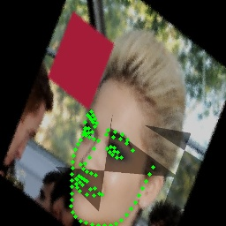
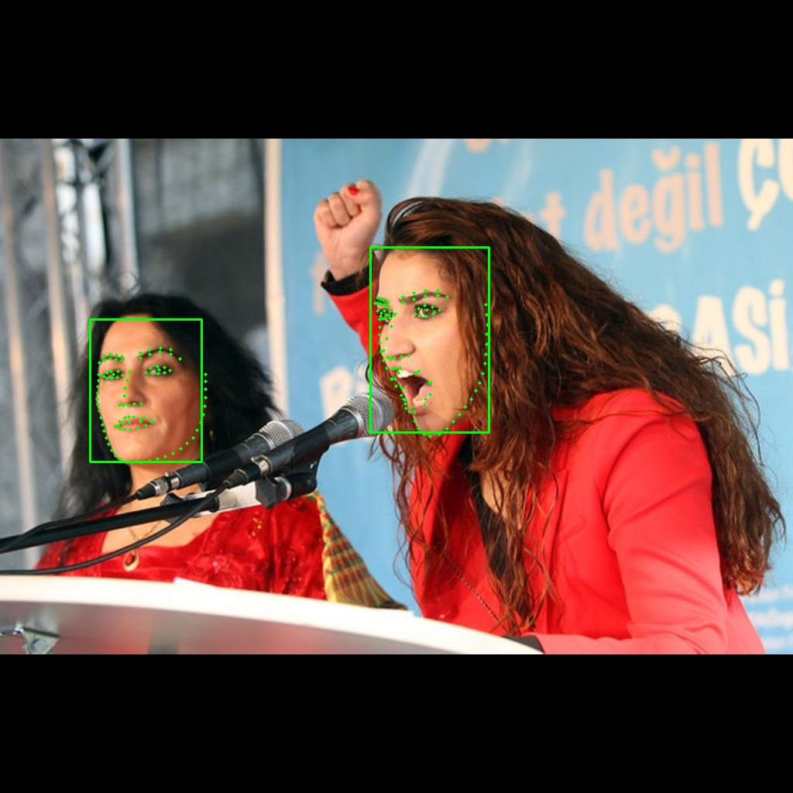
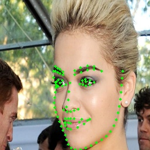
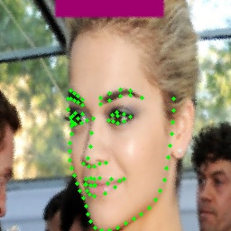
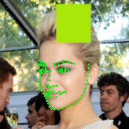
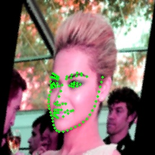

    

<div align='center'>
  
  
  
  
  
  
</div>   
<p align="center">English | <a href="docs/api/transforms.md">中文文档</a> | <a href="https://www.zhihu.com/column/c_1426666301352218624">知乎专栏</a> | <a href="https://pepy.tech/project/torchlm">下载统计</a></p>


## 🤗 Introduction
**torchlm** is aims to build a high level pipeline for face landmarks detection, it supports **training**, **inference** and **100+ data augmentations**, can easily install with **pip**.
<div align='center'>
  
</div>  
<!---
<div align='center'>
  
  
  
  
  
  
  
</div>  
--->

<p align="center"> ❤️ Star 🌟👆🏻 this repo to support me if it does any helps to you, thanks ~  </p>

## 👋 Core Features
* High level pipeline for **training** and **inference**.
* Provides **30+** native landmarks data augmentations.
* Can **bind 80+** transforms from [torchvision](https://github.com/pytorch/vision) and [albumentations](https://github.com/albumentations-team/albumentations) with **one-line-code**.
* Support awesome models for face landmarks detection, such as YOLOX, YOLOv5, ResNet, MobileNet, ShuffleNet and PIPNet, etc.

## 🆕 What's New
* [2022/03/08]: Add **PIPNet**: [Towards Efficient Facial Landmark Detection in the Wild, CVPR2021](https://github.com/jhb86253817/PIPNet)
* [2022/02/13]: Add **30+** native data augmentations and **bind** **80+** transforms from torchvision and albumentations.

## ✅ Supported Models Matrix
✅ = known work and official supported, ❔ = in my plan, but not coming soon.

|[PIPNet](https://github.com/jhb86253817/PIPNet)|YOLOX|YOLOv5|NanoDet|ResNet|MobileNet|ShuffleNet|VIT|...|
|:---:|:---:|:---:|:---:|:---:|:---:|:---:|:---:|:---:
|✅|❔|❔|❔|❔|❔|❔|❔|❔|❔|❔|

## 🔥🔥Performance(@NME)

<div align='center'>
  
  
</div>  

|Model|Backbone|Head|300W|COFW|AFLW|WFLW|Download|
|:---:|:---:|:---:|:---:|:---:|:---:|:---:|:---:|
|PIPNet|MobileNetV2|Heatmap+Regression+NRM|3.40|3.43|1.52|4.79| [link](https://github.com/DefTruth/torchlm/releases/tag/torchlm-0.1.6-alpha)|
|PIPNet|ResNet18|Heatmap+Regression+NRM|3.36|3.31|1.48|4.47| [link](https://github.com/DefTruth/torchlm/releases/tag/torchlm-0.1.6-alpha)|
|PIPNet|ResNet50|Heatmap+Regression+NRM|3.34|3.18|1.44|4.48| [link](https://github.com/DefTruth/torchlm/releases/tag/torchlm-0.1.6-alpha)|
|PIPNet|ResNet101|Heatmap+Regression+NRM|3.19|3.08|1.42|4.31| [link](https://github.com/DefTruth/torchlm/releases/tag/torchlm-0.1.6-alpha)|

## 🛠️ Usage

### Installation
you can install **torchlm** directly from [pypi](https://pypi.org/project/torchlm/). 
```shell
pip3 install torchlm
# install from specific pypi mirrors use '-i'
pip3 install torchlm -i https://pypi.org/simple/
```
or install from source if you want the latest torchlm and install it in editable mode with `-e`.
```shell
# clone torchlm repository locally if you want the latest torchlm
git clone --depth=1 https://github.com/DefTruth/torchlm.git 
cd torchlm
# install in editable mode
pip install -e .
```
<div id="torchlm-NOTE"></div>  


### 🌟🌟Data Augmentation
**torchlm** provides **30+** native data augmentations for landmarks and can **bind** with **80+** transforms from torchvision and albumentations through **torchlm.bind** method. Further, **torchlm.bind** provide a `prob` param at bind-level to force any transform or callable be a random-style augmentation. The data augmentations in **torchlm** are `safe` and `simplest`. Any transform operations at runtime cause landmarks outside will be auto dropped to keep the number of landmarks unchanged. The layout format of landmarks is `xy` with shape `(N, 2)`, `N` denotes the number of the input landmarks. 

* use almost **30+** native transforms from **torchlm** directly
```python
import torchlm
transform = torchlm.LandmarksCompose([
    torchlm.LandmarksRandomScale(prob=0.5),
    torchlm.LandmarksRandomMask(prob=0.5),
    torchlm.LandmarksRandomBlur(kernel_range=(5, 25), prob=0.5),
    torchlm.LandmarksRandomBrightness(prob=0.),
    torchlm.LandmarksRandomRotate(40, prob=0.5, bins=8),
    torchlm.LandmarksRandomCenterCrop((0.5, 1.0), (0.5, 1.0), prob=0.5)
])
```  
<div align='center'>
  
  
  
  
  
  
  
</div>  

Also, a user-friendly API `build_default_transform` is available to build a default transform pipeline.
```python
transform = torchlm.build_default_transform(
    input_size=(input_size, input_size),
    mean=[0.485, 0.456, 0.406],
    std=[0.229, 0.224, 0.225],
    force_norm_before_mean_std=True,  # img/=255. first
    rotate=30,
    keep_aspect=False,
    to_tensor=True  # array -> Tensor & HWC -> CHW
)
```
See [transforms.md](docs/api/transforms.md) for supported transforms sets and more example can be found at [test/transforms.py](test/transforms.py).

<details>
<summary> bind 80+ torchvision and albumentations's transforms </summary>  

**NOTE**: Please install albumentations first if you want to bind albumentations's transforms. If you have the conflict problem between different installed version of opencv (opencv-python and opencv-python-headless, `ablumentations` need opencv-python-headless). Please uninstall the opencv-python and opencv-python-headless first, and then reinstall albumentations. See [albumentations#1140](https://github.com/albumentations-team/albumentations/issues/1140) for more details.

```shell
# first uninstall confilct opencvs
pip uninstall opencv-python
pip uninstall opencv-python-headless
pip uninstall albumentations  # if you have installed albumentations
# then reinstall torchlm
pip install albumentations # will also install deps, e.g opencv
```

Then, check albumentations whether is available. 
```python
torchlm.albumentations_is_available()
```

```python
transform = torchlm.LandmarksCompose([
    torchlm.bind(torchvision.transforms.GaussianBlur(kernel_size=(5, 25)), prob=0.5),  
    torchlm.bind(albumentations.ColorJitter(p=0.5))
])
```

</details>

<details>
<summary> bind custom callable array or Tensor transform functions </summary>  

```python
# First, defined your custom functions
def callable_array_noop(img: np.ndarray, landmarks: np.ndarray) -> Tuple[np.ndarray, np.ndarray]: # do some transform here ...
    return img.astype(np.uint32), landmarks.astype(np.float32)

def callable_tensor_noop(img: Tensor, landmarks: Tensor) -> Tuple[Tensor, Tensor]: # do some transform here ...
    return img, landmarks
```

```python
# Then, bind your functions and put it into the transforms pipeline.
transform = torchlm.LandmarksCompose([
        torchlm.bind(callable_array_noop, bind_type=torchlm.BindEnum.Callable_Array),
        torchlm.bind(callable_tensor_noop, bind_type=torchlm.BindEnum.Callable_Tensor, prob=0.5)
])
```
</details>

<details>
<summary> some global debug setting for torchlm's transform </summary>  

* setup logging mode as `True` globally might help you figure out the runtime details
```python
# some global setting
torchlm.set_transforms_debug(True)
torchlm.set_transforms_logging(True)
torchlm.set_autodtype_logging(True)
```  

some detail information will show you at each runtime, the infos might look like
```shell
LandmarksRandomScale() AutoDtype Info: AutoDtypeEnum.Array_InOut
LandmarksRandomScale() Execution Flag: False
BindTorchVisionTransform(GaussianBlur())() AutoDtype Info: AutoDtypeEnum.Tensor_InOut
BindTorchVisionTransform(GaussianBlur())() Execution Flag: True
BindAlbumentationsTransform(ColorJitter())() AutoDtype Info: AutoDtypeEnum.Array_InOut
BindAlbumentationsTransform(ColorJitter())() Execution Flag: True
BindTensorCallable(callable_tensor_noop())() AutoDtype Info: AutoDtypeEnum.Tensor_InOut
BindTensorCallable(callable_tensor_noop())() Execution Flag: False
Error at LandmarksRandomTranslate() Skip, Flag: False Error Info: LandmarksRandomTranslate() have 98 input landmarks, but got 96 output landmarks!
LandmarksRandomTranslate() Execution Flag: False
```
* Execution Flag: True means current transform was executed successful, False means it was not executed because of the random probability or some Runtime Exceptions(torchlm will should the error infos if debug mode is True).
* AutoDtype Info: 
  * Array_InOut means current transform need a np.ndnarray as input and then output a np.ndarray.
  * Tensor_InOut means current transform need a torch Tensor as input and then output a torch Tensor. 
  * Array_In means current transform needs a np.ndarray input and then output a torch Tensor. 
  * Tensor_In means current transform needs a torch Tensor input and then output a np.ndarray. 
    
  But, is ok if you pass a Tensor to a np.ndarray-like transform, **torchlm** will automatically be compatible with different data types and then wrap it back to the original type through a **autodtype** wrapper.

</details>


### 🎉🎉Training  
In **torchlm**, each model have a high level and user-friendly API named `training`, here is a example of [PIPNet](https://github.com/jhb86253817/PIPNet).

```python
from torchlm.models import pipnet

model = pipnet(backbone="resnet18", pretrained=False, num_nb=10, num_lms=98, net_stride=32,
               input_size=256, meanface_type="wflw", backbone_pretrained=True)

model.training(
    annotation_path: str,
    criterion_cls: nn.Module = nn.MSELoss(),
    criterion_reg: nn.Module = nn.L1Loss(),
    learning_rate: float = 0.0001,
    # ...
    **kwargs: Any  # params for DataLoader
) -> nn.Module:
```  
<details>
<summary> How to train PIPNet in your own dataset and custom meanface settings?  </summary>

* setup your custom meanface and nearest-neighbor landmarks through `set_custom_meanface` method, this method will calculate the distance between landmarks in meanface and auto setup the nearest-neighbors for each landmarks.

```python
def set_custom_meanface(
        self,
        custom_meanface_file_or_string: str
) -> bool:
    """
    :param custom_meanface_file_or_string: a long string or a file contains normalized
    or un-normalized meanface coords, the format is "x0,y0,x1,y1,x2,y2,...,xn-1,yn-1".
    :return: status, True if successful.
    """
```


</details>

Please jump to the entry point of the function for the detail documentations of **training** API for each defined models in torchlm, e.g [pipnet/_impls.py#L166](https://github.com/DefTruth/torchlm/blob/main/torchlm/models/pipnet/_impls.py#L159). 


### 👀👇 Inference
#### C++ API
The ONNXRuntime(CPU/GPU), MNN, NCNN and TNN C++ inference of **torchlm** will be release at [lite.ai.toolkit](https://github.com/DefTruth/lite.ai.toolkit).
#### Python API
In **torchlm**, a high level API named `runtime.bind` can bind face detection and landmarks models together, then you can run the `runtime.forward` API to get the output landmarks and bboxes, here is a example of [PIPNet](https://github.com/jhb86253817/PIPNet). Pretrained weights of PIPNet, [Download](https://github.com/DefTruth/torchlm/releases/tag/torchlm-0.1.6-alpha).
```python
import torchlm
from torchlm.tools import faceboxesv2
from torchlm.models import pipnet

torchlm.runtime.bind(faceboxesv2())
torchlm.runtime.bind(
  pipnet(backbone="resnet18", pretrained=True,  
         num_nb=10, num_lms=98, net_stride=32, input_size=256,
         meanface_type="wflw", map_location="cpu", checkpoint=None)
) # will auto download from latest release if pretrained=True
landmarks, bboxes = torchlm.runtime.forward(image)
image = torchlm.utils.draw_bboxes(image, bboxes=bboxes)
image = torchlm.utils.draw_landmarks(image, landmarks=landmarks)
```
<div align='center'>
  
  
  
</div>  

## 📖 Documentations
* [x] [Data Augmentation's API](docs/api/transforms.md) 

## 🎓 License 
The code of **torchlm** is released under the MIT License.

## ❤️ Contribution
Please consider ⭐ this repo if you like it, as it is the simplest way to support me.

## 👋 Acknowledgement  
The implementation of torchlm's transforms borrow the code from [Paperspace](https://github.com/Paperspace/DataAugmentationForObjectDetection/blob/master/data_aug/bbox_util.py) .  
