# Data Augmentations API

## Contents
* [torchlm原生数据增强方法API文档](#torchlm-transforms-api)
* [Native Torchlm's Transforms](#torchlm-native-transforms)
* [Transforms from TorchVision](#torchlm-torchvision-transforms)
* [Transforms from Albumentations](#torchlm-albumentations-transforms)

## torchlm原生数据增强方法API文档
<div id="torchlm-transforms-api"></div>  

* LandmarksNormalize: 对img进行归一化处理，x = (x - mean) / std，对于landmarks不做任何处理。初始化参数说明，mean: float, 均值，默认为127.5；std: float, 标准差，默认128.0；

```python
class LandmarksNormalize(LandmarksTransform):
   def __init__(
            self,
            mean: float = 127.5,
            std: float = 128.
   ):
```

* LandmarksUnNormalize：对img进行反归一化处理，x = x * std + std，对于landmarks不做任何处理。初始化参数说明，mean: float, 均值，默认为127.5；std: float, 标准差，默认128.0；

```python
class LandmarksUnNormalize(LandmarksTransform):
    def __init__(
            self,
            mean: float = 127.5,
            std: float = 128.
    ):
```

* LandmarksToTensor：将img和landmarks从numpy数组转换成Tensor，无初始化参数

```python
class LandmarksToTensor(LandmarksTransform):
    def __init__(self):
```

* LandmarksToNumpy: 将img和landmarks从Tensor转换成numpy数组，无初始化参数

```python
class LandmarksToNumpy(LandmarksTransform):
    def __init__(self):
```

* LandmarksResize: 对img进行resize，并且调整landmarks坐标。初始化参数说明，size: Union[Tuple[int, int], int]，目标图片resize后大小，顺序为(w,h)；keep_aspect: bool，是否保持尺度不变，默认False；如果设置为True，则保持输入img宽高比率不变，并对空白区域进行零值padding。

```python
class LandmarksResize(LandmarksTransform):
    def __init__(
            self,
            size: Union[Tuple[int, int], int],
            keep_aspect: bool = False
    ):
```

* LandmarksClip：以landmarks外接矩形框为中心，在img上进行裁剪操作。比如我们通常要去掉一些冗余的背景区域，只在landmarks外接矩形的某个延展区域内进行估计点位。初始化参数说明，width_pad: float，默认0.2，相对于landmarks的宽的扩张比率，扩张后的框宽为landmarks外接矩形的(width_pad+1.+width_pad)倍；height_pad: float，默认0.2，相对于landmarks的高的扩张比率，扩张后的框高为landmarks外接矩形的(height_pad+1.+height_pad)倍；target_size：Union[Tuple[int, int], int]，默认为None，这个表示clip之后，是否要再resize到某个指定的尺寸；如果要对clip后得到的img重新resize到指定的target_size，则kwargs，表示传给LandmarksResize的参数，否则该参数无任何作用。

```python
class LandmarksClip(LandmarksTransform):
    def __init__(
            self,
            width_pad: float = 0.2,
            height_pad: float = 0.2,
            target_size: Union[Tuple[int, int], int] = None,
            **kwargs
    ):
```

* LandmarksRandomCenterCrop: 随机中心裁剪，将会以img的中心点(cx,cy)为中心，按照指定的宽高可选的比率范围，随机选择宽高比率进行裁剪。该改变换会根据图片实际裁剪的比率变动landmarks的坐标，并且会自动检查点位坐标是否越界的“安全性”，确保crop的区域一定会包含所有的点位。一般来说，随机中心裁剪对**模拟人脸检测器带来的抖动比较有用**，避免对某种固定尺寸比率的人脸矩形框过拟合。实际应用的时候，通常无法保证上游的人脸检测器是不会更改的，所以这种人脸框的抖动几乎是必然存在的。随机中心裁剪就可以模拟这种情形。初始化参数说明，width_range: Tuple[float, float]，宽的比率选择范围，默认为，(0.8, 1.0)，假设随机选择了一个比率w_r，原来图像的宽为img_w，则最后crop的宽是(w_r * img_w)，并且这个crop不是以(cx,cy)为中心对称的，而是会在确保包含所有点位的基础上，随机左右偏移；height_range: Tuple[float, float]，宽的比率选择范围，默认为，(0.8, 1.0)，假设随机选择了一个比率h_r，原来图像的宽为img_h，则最后crop的宽是(h_r * img_h)，并且这个crop不是以(cx,cy)为中心对称的，而是会在确保包含所有点位的基础上，随机上下偏移；prob: float，默认0.5，发生的概率。

```python
class LandmarksRandomCenterCrop(LandmarksTransform):
    def __init__(
            self,
            width_range: Tuple[float, float] = (0.8, 1.0),
            height_range: Tuple[float, float] = (0.8, 1.0),
            prob: float = 0.5
    ):
```
```python
transform = torchlm.LandmarksCompose([
        torchlm.LandmarksRandomCenterCrop(width_range=(0.5, 0.1), height_range=(0.5, 0.1), prob=1.),
        torchlm.LandmarksResize((256, 256))
    ])
```
<div align='center'>
  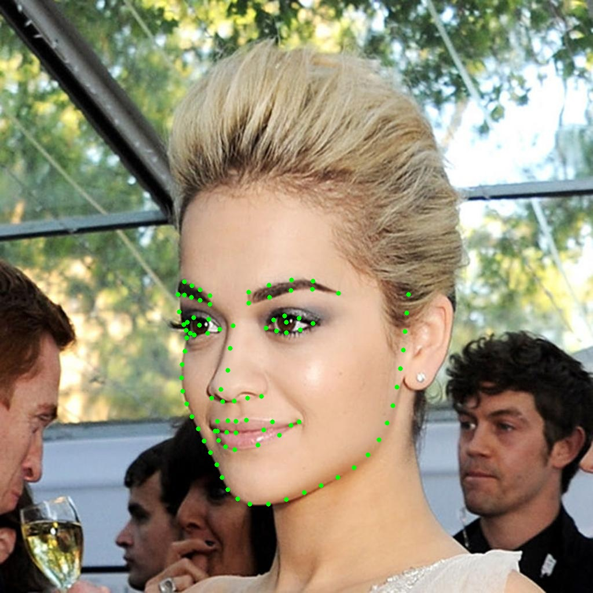
  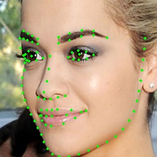
  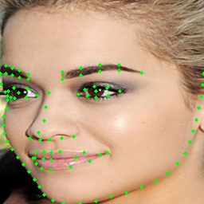
  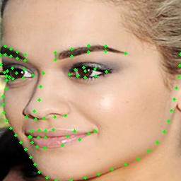
  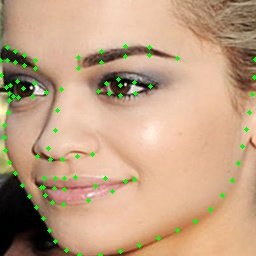
  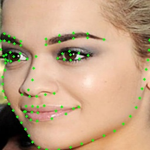
  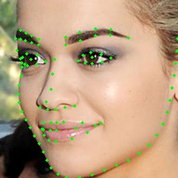
</div>  

* LandmarksHorizontalFlip: 水平镜像翻转，无初始化参数。注意，这个方法会改变点位的索引顺序，所以一般不要使用，除非你的任务是允许进行镜像的，否则你的loss可能一直无法收敛哦。这是个坑来的（亲自踩过的），这里还是实现了这个方法，留给有缘人踩一踩。

```python
class LandmarksHorizontalFlip(LandmarksTransform):
    """WARNING: HorizontalFlip augmentation mirrors the input image. When you apply
     that augmentation to keypoints that mark the side of body parts (left or right),
     those keypoints will point to the wrong side (since left on the mirrored image
     becomes right). So when you are creating an augmentation pipeline look carefully
     which augmentations could be applied to the input data. Also see:
     https://albumentations.ai/docs/getting_started/keypoints_augmentation/
    """
    def __init__(self):
```

* LandmarksRandomHorizontalFlip: 随机版本的水平镜像翻转，初始化参数说明，prob: float，默认0.5，发生的概率。这个是随机版本的坑，更坑，是留给更有缘人去踩的。如果你的任务本质上不允许进行镜像，而你又用了这个数据增强，那么恭喜你，有缘人，你更难发现这个坑了，因为这个loss可能时而下降时而上升，也可能是收敛到某个看似正常的地方却一直下不去了（当镜像发生的概率很小时）。**用咱们修真界的话来讲就是，这就是一颗传说中的“天品毒丹”啊，非有缘人而不可得，实乃调参炼药坑己坑人，必备良药啊，请各位有缘人务必收好**。

```python
class LandmarksRandomHorizontalFlip(LandmarksTransform):
    """WARNING: HorizontalFlip augmentation mirrors the input image. When you apply
     that augmentation to keypoints that mark the side of body parts (left or right),
     those keypoints will point to the wrong side (since left on the mirrored image
     becomes right). So when you are creating an augmentation pipeline look carefully
     which augmentations could be applied to the input data. Also see:
     https://albumentations.ai/docs/getting_started/keypoints_augmentation/
    """
    def __init__(
            self,
            prob: float = 0.5
    ):
```

* LandmarksAlign：人脸对齐。这个主要是用在人脸关键点检测的任务上，并且不一定是数据增强，主要为为了便于获得一张对齐后的人脸和对齐后的关键点。初始化参数说明，eyes_index: Union[Tuple[int, int], List[int]]，必须要指定的左右眼中心点在landmarks中的索引。

```python
class LandmarksAlign(LandmarksTransform):
    def __init__(
            self,
            eyes_index: Union[Tuple[int, int], List[int]] = None
    ):
```
```python
transform = torchlm.LandmarksCompose([
        torchlm.LandmarksRandomRotate(80, prob=1.),  # 先增加旋转
        torchlm.LandmarksRandomAlign(eyes_index=(96, 97), prob=1.),  # 再进行对齐看效果
        torchlm.LandmarksResize((256, 256))
    ])
```
<div align='center'>
  
  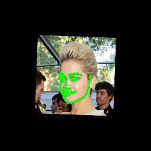
  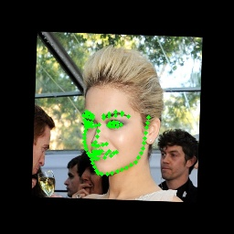
  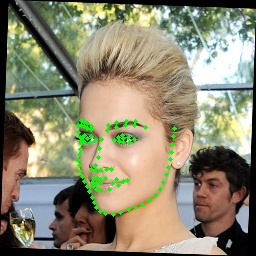
  
  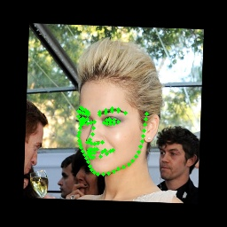
  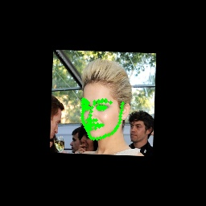
</div>  

* LandmarksRandomAlign：随机版本的人脸对齐。这个主要是用在人脸关键点检测的任务上，可用作数据增强。可能出于某种奇怪的原因，你想随机地将一部分人脸根据关键点进行对齐后，作为训练数据，那么就可以使用这个数据增强方法。初始化参数说明，eyes_index: Union[Tuple[int, int], List[int]]，必须要指定的左右眼中心点在landmarks中的索引；prob: float，默认0.5，发生的概率。

```python
class LandmarksRandomAlign(LandmarksTransform):
    def __init__(
            self,
            eyes_index: Union[Tuple[int, int], List[int]] = None,
            prob: float = 0.5
    ):
```

* LandmarksRandomScale：随机尺度变换。从指定的scale可选值域范围内挑选比率，对输入的图片进行尺度变换，拉伸变形，并同时调整landmarks的坐标。初始化参数说明，scale: Union[Tuple[float, float], float]，scale变化的范围比率，相对于原图片的宽高；prob: float，默认0.5，发生的概率；diff: bool，是否让宽高的比率是随机不一致的，默认True，若为False，对图片按照宽高选择到的相同比率进行拉伸。

```python
class LandmarksRandomScale(LandmarksTransform):
    def __init__(
            self,
            scale: Union[Tuple[float, float], float] = 0.4,
            prob: float = 0.5,
            diff: bool = True
    ):
```
```python
transform = torchlm.LandmarksCompose([
        torchlm.LandmarksRandomScale(scale=(-0.5, 1.5), prob=1.),
        torchlm.LandmarksResize((256, 256), keep_aspect=True)
    ])
```
<div align='center'>
  
  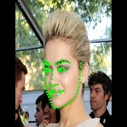
  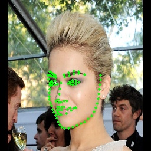
  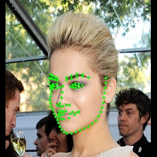
  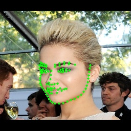
  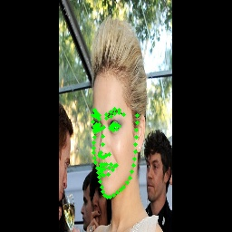
  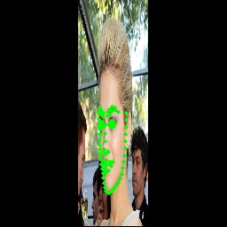
</div>  

* LandmarksRandomShear：随机剪切变化。对图片进行剪切变化，并同时调整landmarks坐标。初始化参数说明，shear_factor: Union[Tuple[float, float], List[float], float]，随机剪切的比率范围，通常是(-1.,1)之间；prob: float，默认0.5，发生的概率；

```python
class LandmarksRandomShear(LandmarksTransform):
    def __init__(
            self,
            shear_factor: Union[Tuple[float, float], List[float], float] = 0.2,
            prob: float = 0.5
    ):
```
```python
transform = torchlm.LandmarksCompose([
        torchlm.LandmarksRandomShear(prob=1.),
        torchlm.LandmarksResize((256, 256))
    ])
```
<div align='center'>
  
  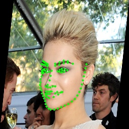
  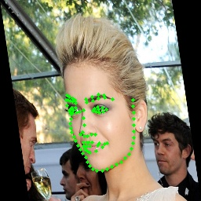
  
  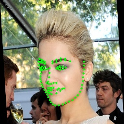
  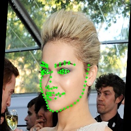
  
</div>  

* LandmarksRandomHSV: 随机HSV颜色空间变换。对图片进行颜色HSV的颜色空间的随机像素调整，这是一个image-only变换，不改变landmarks的坐标位置。初始化参数说明，hue: Union[Tuple[int, int], int]，色度色温变画范围，建议(-20,+20)之间；saturation: Union[Tuple[int, int], int]，饱和度变化范围，建议(-20,+20)之间；brightness: Union[Tuple[int, int], int]，亮度变化范围，建议(-20,+20)之间；prob: float，默认0.5，发生的概率；

```python
class LandmarksRandomHSV(LandmarksTransform):
    def __init__(
            self,
            hue: Union[Tuple[int, int], int] = 20,
            saturation: Union[Tuple[int, int], int] = 20,
            brightness: Union[Tuple[int, int], int] = 20,
            prob: float = 0.5
    ):
```
```python
transform = torchlm.LandmarksCompose([
        torchlm.LandmarksRandomHSV(prob=1.),
        torchlm.LandmarksResize((256, 256))
    ])
```
<div align='center'>
  
  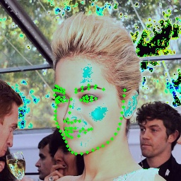
  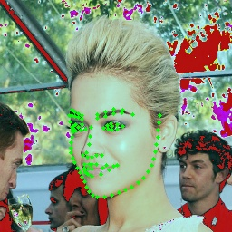
  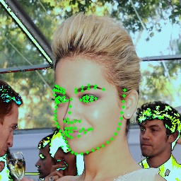
  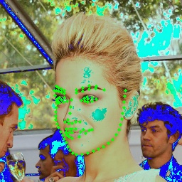
  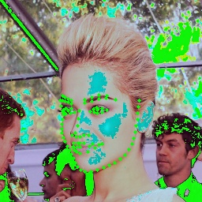
  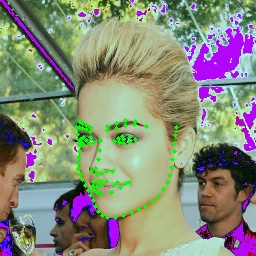
</div>  

* LandmarksRandomTranslate：随机平移变换。对输入的图像，从给定的平移比率范围内随机选择一个比率进行平移变化，并且对应改变landmarks的坐标位置。平移变换有可能会使得部分landmarks越界，这也在内部做了数据的"安全性"判断，会自动撤销不安全的变换，确保landmarks在变换前后数量的一致性。初始化参数说明，translate: Union[Tuple[float, float], float]，平移的比率范围，建议是(-0.2,0.2)；prob: float，默认0.5，发生的概率；diff: bool，是否在宽高方向使用不同的平移比率，默认为False；

```python
class LandmarksRandomTranslate(LandmarksTransform):
    def __init__(
            self,
            translate: Union[Tuple[float, float], float] = 0.2,
            prob: float = 0.5,
            diff: bool = False
    ):
```
```python
transform = torchlm.LandmarksCompose([
        torchlm.LandmarksRandomTranslate(prob=1.),
        torchlm.LandmarksResize((256, 256))
    ])
```
<div align='center'>
  
  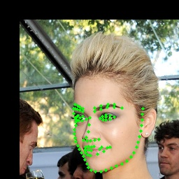
  
  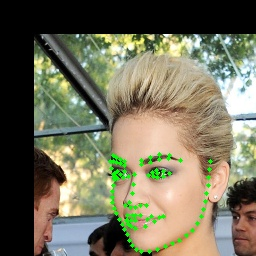
  
  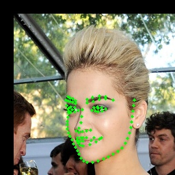
  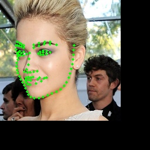
</div>  

* LandmarksRandomRotate: 随机旋转变换。对输入的图像，从给定的角度范围内随机选择一个角度进行旋转变化，并且对应改变landmarks的坐标位置。旋转变换有可能会使得部分landmarks越界，这也在内部做了数据的"安全性"判断，会自动撤销不安全的变换，确保landmarks在变换前后数量的一致性。初始化参数说明，angle: Union[Tuple[int, int], List[int], int]，角度变化的范围，建议(-90,+90)；prob: float，默认0.5，发生的概率；bins: Optional[int]，可以指定将angle范围内的角度，等距离地划分为多少bin；

```python
class LandmarksRandomRotate(LandmarksTransform):
    def __init__(
            self,
            angle: Union[Tuple[int, int], List[int], int] = 10,
            prob: float = 0.5,
            bins: Optional[int] = None
    ):
```
```python
transform = torchlm.LandmarksCompose([
        torchlm.LandmarksRandomRotate(angle=80, prob=1.),
        torchlm.LandmarksResize((256, 256))
    ])
```
<div align='center'>
  
  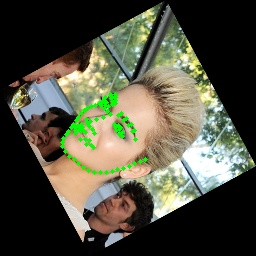
  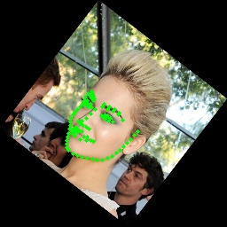
  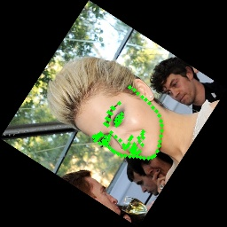
  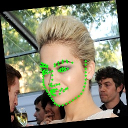
  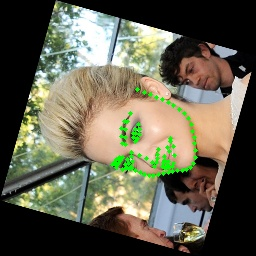
  
</div>  

* LandmarksRandomBlur: 随机高斯模糊。对输入的图像，从给定的kernel范围内随机选择一个kernel，进行高斯模糊，该变换是image-only变换，不改变landmarks的坐标位置。这种变换可用用来模拟模糊的场景，能够提高模型的泛化能力。可以想象，如果你的关键点检测器都是在很清晰的图片上训练的，那么实际应用的时候，遇到模糊的场景可能就完了，况且，模糊是一种很常见的场景。初始化参数说明，kernel_range: Tuple[int, int]，高斯kernel的选择范围，值越大越模糊，默认是(3, 11)；prob: float，默认0.5，发生的概率；sigma_range: Tuple[int, int] ，方差的选择范围，默认 (0, 4)，用默认的就行。

```python
class LandmarksRandomBlur(LandmarksTransform):
    def __init__(
            self,
            kernel_range: Tuple[int, int] = (3, 11),
            prob: float = 0.5,
            sigma_range: Tuple[int, int] = (0, 4)
    ):
```
```python
transform = torchlm.LandmarksCompose([
        torchlm.LandmarksResize((256, 256)),
        torchlm.LandmarksRandomBlur(kernel_range=(5, 35), prob=1.)
    ])
```
<div align='center'>
  
  
  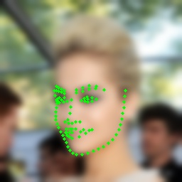
  
  
  
  
</div>  

* LandmarksRandomBrightness: 随机亮度和对比度变化。对输入的图像，从给定的亮度和对比度变化范围内随机选择值，进行亮度和对比度变化，该变换是image-only变换，不改变landmarks的坐标位置。初始化参数说明，brightness: Tuple[float, float]，亮度变化范围，默认 (-30., 30.)；contrast: Tuple[float, float]，对比度变化范围，默认(0.5, 1.5)；prob: float，默认0.5，发生的概率；

```python
class LandmarksRandomBrightness(LandmarksTransform):
    def __init__(
            self,
            brightness: Tuple[float, float] = (-30., 30.),
            contrast: Tuple[float, float] = (0.5, 1.5),
            prob: float = 0.5
    ):
```
```python
transform = torchlm.LandmarksCompose([
        torchlm.LandmarksRandomBrightness(prob=1.),
        torchlm.LandmarksResize((256, 256))
    ])
```
<div align='center'>
  
  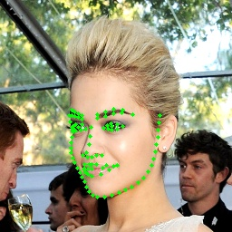
  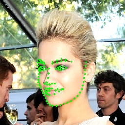
  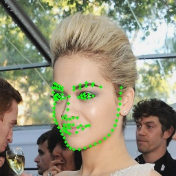
  
  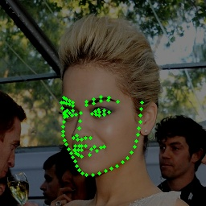
  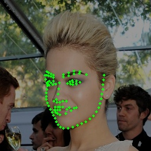
</div>  

* LandmarksRandomMask: 随机遮挡变换。从给定的mask面积比率范围内随机选择一个面积比率，在原图上随机选一块该面积大小，矩形形状随机的方块进行mask，并且mask的值也是随机的。该变换是image-only变换，不改变landmarks的坐标位置。初始化参数说明，mask_ratio: float，遮挡的比率最大值，默认0.1，指被遮挡区域占输入图片的面积的比率；prob: float，默认0.5，发生的概率；trans_ratio: float，默认0.5，控制mask区域的随机形状，用默认值行。

```python
class LandmarksRandomMask(LandmarksTransform):
    def __init__(
            self,
            mask_ratio: float = 0.1,
            prob: float = 0.5,
            trans_ratio: float = 0.5
    ):
```  
```python
transform = torchlm.LandmarksCompose([
        torchlm.LandmarksRandomMask(prob=1.),
        torchlm.LandmarksResize((256, 256))
    ])
```
<div align='center'>
  
  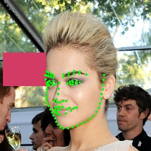
  
  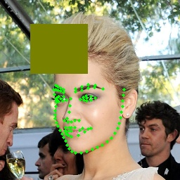
  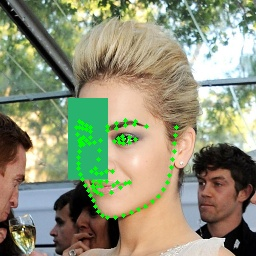
  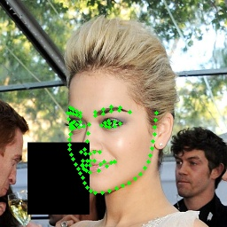
  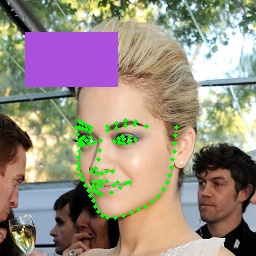
</div>  

* LandmarksRandomMaskMixUp：带Alpha融合的随机遮挡变化。torchlm特有的。 随机遮挡变换。从给定的mask面积比率范围内随机选择一个面积比率，在原图上随机选一块该面积大小，矩形形状随机的方块，按照随机挑选的alpha比率进行alpha融合，制造类似阴影的效果，mask的值也是随机的。该变换是image-only变换，不改变landmarks的坐标位置。初始化参数说明，mask_ratio: float，遮挡的比率最大值，默认0.1，指被遮挡区域占输入图片的面积的比率；prob: float，默认0.5，发生的概率；trans_ratio: float，默认0.5，控制mask区域的随机形状，用默认值行； alpha: float，mask可选最大alpha值，默认0.9；

```python
class LandmarksRandomMaskMixUp(LandmarksTransform):

    def __init__(
            self,
            mask_ratio: float = 0.25,
            prob: float = 0.5,
            trans_ratio: float = 0.5,
            alpha: float = 0.9
    ):
```  
```python
transform = torchlm.LandmarksCompose([
        torchlm.LandmarksRandomMaskMixUp(prob=1.),
        torchlm.LandmarksResize((256, 256))
    ])
```
<div align='center'>
  
  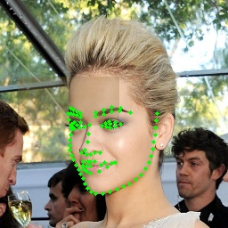
  
  
  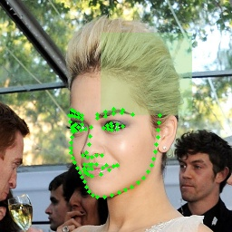
  
  
</div>  

* LandmarksRandomPatches：随机打补丁变换。这是torchlm特有的，该版本类似随机mask，其实是一个假的MixUp，这里没有使用alpha进行融合；该类型会把随机选择到的patch图像块，随机地填充到原图的一块区域，该类型需要指定patches图片集。当然，除了可以手动指定patches图片集合的路径外，也可以使用默认的，torchlm已经内置了100张随机的背景图片，大家可以不用额外准备这个图片集。初始化参数说明，patch_dirs: List[str]，指定使用的patches图片集，若不指定则会使用torchlm自带的；patch_ratio: float，最大的打补丁面积，默认0.15；prob: float，默认0.5，发生的概率；trans_ratio: float，默认0.5，控制打补丁区域的随机形状，用默认值行。

```python
class LandmarksRandomPatches(LandmarksTransform):

    def __init__(
            self,
            patch_dirs: List[str] = None,
            patch_ratio: float = 0.15,
            prob: float = 0.5,
            trans_ratio: float = 0.5
    ):
```  
```python
transform = torchlm.LandmarksCompose([
        torchlm.LandmarksRandomPatches(prob=1.),
        torchlm.LandmarksResize((256, 256))
    ])
```
<div align='center'>
  
  
  
  
  
  
  
</div>  

* LandmarksRandomPatchesMixUp：带Alpha融合的随机打补丁变换。这是torchlm特有的，针对关键点检测的改造的一个MixUp版本，在分类和目标检测领域大名鼎鼎的MixUp，当然可以考虑修改一下用到关键点检测当中。该类型会把随机选择到的patch图像块，根据随机选择的alpha比率，随机地填充到原图的一块区域，该类型需要指定patches图片集。当然，除了可以手动指定patches图片集合的路径外，也可以使用默认的，torchlm已经内置了100张随机的背景图片，大家可以不用额外准备这个图片集。初始化参数说明，patch_dirs: List[str]，指定使用的patches图片集，若不指定则会使用torchlm自带的；patch_ratio: float，最大的打补丁面积，默认0.15；prob: float，默认0.5，发生的概率；trans_ratio: float，默认0.5，控制打补丁区域的随机形状，用默认值行；alpha: float，patch可选最大alpha值，默认0.9；

```python
class LandmarksRandomPatchesMixUp(LandmarksTransform):
    def __init__(
            self,
            patch_dirs: List[str] = None,
            patch_ratio: float = 0.2,
            prob: float = 0.5,
            trans_ratio: float = 0.5,
            alpha: float = 0.9
    ):
```  
```python
transform = torchlm.LandmarksCompose([
        torchlm.LandmarksRandomPatchesMixUp(alpha=0.5, prob=1.),
        torchlm.LandmarksResize((256, 256))
    ])
```
<div align='center'>
  
  
  
  
  
  
  
</div>  

* LandmarksRandomBackground：随机背景替换变换。torchlm特有的。随机从指定的背景图片集合中选择一张背景图片，从中随机裁剪一块，按照填充的方式，将输入的图片填充到选定的背景上，该变换会改变landmarks的坐标位置。初始化参数说明，background_dirs: List[str]，指定使用的backgrounds图片集，若不指定则会使用torchlm自带的；prob: float，默认0.5，发生的概率；

```python
class LandmarksRandomBackground(LandmarksTransform):
    def __init__(
            self,
            background_dirs: List[str] = None,
            prob: float = 0.5
    ):
```  
```python
transform = torchlm.LandmarksCompose([
        torchlm.LandmarksRandomBackground(prob=1.),
        torchlm.LandmarksResize((256, 256))
    ])
```
<div align='center'>
  
  
  
  
  
  
  
</div>  

* LandmarksRandomBackgroundMixUp：带Alpha融合的随机背景替换变换。torchlm特有的。是我实现的MixUp在关键点检测的一个特例。随机从指定的背景图片集合中选择一张背景图片，从中随机裁剪一块，按照随机选择一个alpha比率融合到输入的图片上，该变换是image-only变换，不会改变Landmarks的坐标位置。初始化参数说明，background_dirs: List[str]，指定使用的backgrounds图片集，若不指定则会使用torchlm自带的；prob: float，默认0.5，发生的概率；alpha: float，background可选最大alpha值，默认0.3，注意这个值不能太大；

```python
class LandmarksRandomBackgroundMixUp(LandmarksTransform):
    def __init__(
            self,
            background_dirs: List[str] = None,
            alpha: float = 0.3,
            prob: float = 0.5
    ):
```  
```python
transform = torchlm.LandmarksCompose([
        torchlm.LandmarksRandomBackgroundMixUp(alpha=0.5, prob=1.),
        torchlm.LandmarksResize((256, 256))
    ])
```
<div align='center'>
  
  
  
  
  
  
  
</div>  

* BindAlbumentationsTransform：绑定albumentations数据增强方法的wrapper类，不建议直接使用。初始化参数说明，transform，指定一个albumentations的transform；prob，发生的概率，和torchlm.bind中的prob参数含义相同。

```python
class BindAlbumentationsTransform(LandmarksTransform):
    def __init__(
            self,
            transform: Albumentations_Transform_Type,
            prob: float = 1.0
    ):
```  

* BindTorchVisionTransform：绑定torchvision数据增强方法的wrapper类，不建议直接使用。初始化参数说明，transform，指定一个torchvision的transform；prob，发生的概率，和torchlm.bind中的prob参数含义相同。
  
```python
class BindTorchVisionTransform(LandmarksTransform):
    def __init__(
            self,
            transform: TorchVision_Transform_Type,
            prob: float = 1.0
    ):
```  

* BindArrayCallable：绑定自定义numpy输入输出数据增强方法的wrapper类，不建议直接使用。初始化参数说明，call_func，指定一个numpy输入输出的自定义数据增强函数；prob，发生的概率，和torchlm.bind中的prob参数含义相同。
  
```python
class BindArrayCallable(LandmarksTransform):
    def __init__(
            self,
            call_func: Callable_Array_Func_Type,
            prob: float = 1.0
    ):
```  

* BindTensorCallable：绑定自定义Tensor输入输出数据增强方法的wrapper类，不建议直接使用。初始化参数说明，call_func，指定一个Tensor输入输出的自定义数据增强函数；prob，发生的概率，和torchlm.bind中的prob参数含义相同。
  
```python
class BindTensorCallable(LandmarksTransform):
    def __init__(
            self,
            call_func: Callable_Tensor_Func_Type,
            prob: float = 1.0
    ):
```  

* LandmarksCompose：关键点数据增强的pipeline。初始化参数说明，transforms，指定一个数据增强类型列表。

```python
class LandmarksCompose(object):

    def __init__(
            self,
            transforms: List[LandmarksTransform]
    ):
```  
### Usage 
#### 使用torchlm中的数据增强方法
一个示例性质的pipeline如下所示，用法很简单。
```python
import torchlm
transform = torchlm.LandmarksCompose([
        # use native torchlm transforms
        torchlm.LandmarksRandomScale(prob=0.5),
        torchlm.LandmarksRandomTranslate(prob=0.5),
        torchlm.LandmarksRandomShear(prob=0.5),
        torchlm.LandmarksRandomMask(prob=0.5),
        torchlm.LandmarksRandomBlur(kernel_range=(5, 25), prob=0.5),
        torchlm.LandmarksRandomBrightness(prob=0.),
        torchlm.LandmarksRandomRotate(40, prob=0.5, bins=8),
        torchlm.LandmarksRandomCenterCrop((0.5, 1.0), (0.5, 1.0), prob=0.5),
        # ...
    ])
```

#### 绑定torchvision和albumentations的数据增强方法
通过torchlm.bind可以一行代码兼容torchvision和albumentations的数据增强方法，并且自动处理数据类型转换和数据“安全性”检查。
```python
import torchvision
import albumentations
import torchlm
transform = torchlm.LandmarksCompose([
        # use native torchlm transforms
        torchlm.LandmarksRandomScale(prob=0.5),
        # bind torchvision image only transforms, bind with a given prob
        torchlm.bind(torchvision.transforms.GaussianBlur(kernel_size=(5, 25)), prob=0.5),  
        torchlm.bind(torchvision.transforms.RandomAutocontrast(p=0.5)),
        # bind albumentations image only transforms
        torchlm.bind(albumentations.ColorJitter(p=0.5)),
        torchlm.bind(albumentations.GlassBlur(p=0.5)),
        # bind albumentations dual transforms
        torchlm.bind(albumentations.RandomCrop(height=200, width=200, p=0.5)),
        torchlm.bind(albumentations.Rotate(p=0.5)),
        # ...
    ])
```
<div align='center'>
  
  
  
  
  
  
  
  <br>
  
  
  
  
  
  
  
</div>  

#### 绑定用户自定义的数据增强方法
还可以通过torchlm.bind可以一行代码绑定用户自定义的数据增强方法，并且自动处理数据类型转换和数据“安全性”检查。
```python
# First, defined your custom functions
def callable_array_noop(img: np.ndarray, landmarks: np.ndarray) -> Tuple[np.ndarray, np.ndarray]:
    # do some transform here ...
    return img.astype(np.uint32), landmarks.astype(np.float32)

def callable_tensor_noop(img: Tensor, landmarks: Tensor) -> Tuple[Tensor, Tensor]:
    # do some transform here ...
    return img, landmarks
```

```python
# Then, bind your functions and put it into the transforms pipeline.
transform = torchlm.LandmarksCompose([
        # use native torchlm transforms
        torchlm.LandmarksRandomScale(prob=0.5),
        # bind custom callable array functions
        torchlm.bind(callable_array_noop, bind_type=torchlm.BindEnum.Callable_Array),
        # bind custom callable Tensor functions with a given prob
        torchlm.bind(callable_tensor_noop, bind_type=torchlm.BindEnum.Callable_Tensor, prob=0.5),  
        # ...
    ])
```

#### torchlm的全局调试设置 
通过设置一些全局选项，方便你对数据增强进行调试，以便定位到底是哪里出了问题。
```python
import torchlm
# some global setting
torchlm.set_transforms_debug(True)
torchlm.set_transforms_logging(True)
torchlm.set_autodtype_logging(True)
```
如果设置了这些全局选项为True，那么每次数据增强的pipeline在运行时，都会输出一些有用的信息，辅助你进行判断和检查。
```text
LandmarksRandomScale() AutoDtype Info: AutoDtypeEnum.Array_InOut
LandmarksRandomScale() Execution Flag: False
BindTorchVisionTransform(GaussianBlur())() AutoDtype Info: AutoDtypeEnum.Tensor_InOut
BindTorchVisionTransform(GaussianBlur())() Execution Flag: True
BindAlbumentationsTransform(ColorJitter())() AutoDtype Info: AutoDtypeEnum.Array_InOut
BindAlbumentationsTransform(ColorJitter())() Execution Flag: True
BindTensorCallable(callable_tensor_noop())() AutoDtype Info: AutoDtypeEnum.Tensor_InOut
BindTensorCallable(callable_tensor_noop())() Execution Flag: False
Error at LandmarksRandomTranslate() Skip, Flag: False Error Info: LandmarksRandomTranslate() have 98 input landmarks, but got 96 output landmarks!
LandmarksRandomTranslate() Execution Flag: False
```
* Execution Flag: True 表示该变换被成功执行, False 则表示没有被成功执行，这可能是由于随机概率被跳过了，也可能是出现了运行时异常 (当debug mode 是 True 时，torchlm会中断pipeline并抛出详细的异常信息).
* AutoDtype Info: 
  * Array_InOut 意味着当前的变换需要 np.ndnarray 作为输入，并且输出 np.ndarray.
  * Tensor_InOut 意味着当前的变换需要 Tensor 作为输入，并且输出 Tensor.
  * Array_In 意味着当前的变换需要 np.ndnarray 作为输入，并且输出 Tensor.
  * Tensor_In 意味着当前的变换需要 Tensor 作为输入，并且输出 np.ndarray. 
    
  
  如果你不小心往一个需要numpy数组输入的变换传了Tensor，也是没有影响的，**torchlm** 会通过 **autodtype** 装饰器自动兼容不同的数据类型，并且在变换完成后，自动地将输出的数据转换为原来的类型。

#### 一个torchlm关键点数据增强的完整案例
```python
import cv2
import numpy as np
import torchvision
import albumentations
from torch import Tensor
from typing import Tuple

import torchlm

def callable_array_noop(
        img: np.ndarray,
        landmarks: np.ndarray
) -> Tuple[np.ndarray, np.ndarray]:
    # Do some transform here ...
    return img.astype(np.uint32), landmarks.astype(np.float32)


def callable_tensor_noop(
        img: Tensor,
        landmarks: Tensor
) -> Tuple[Tensor, Tensor]:
    # Do some transform here ...
    return img, landmarks


def test_torchlm_transforms_pipeline():
    print(f"torchlm version: {torchlm.__version__}")
    seed = np.random.randint(0, 1000)
    np.random.seed(seed)

    img_path = "./2.jpg"
    anno_path = "./2.txt"
    save_path = f"./logs/2_wflw_{seed}.jpg"
    img = cv2.imread(img_path)[:, :, ::-1].copy()  # RGB
    with open(anno_path, 'r') as fr:
        lm_info = fr.readlines()[0].strip('\n').split(' ')

    landmarks = [float(x) for x in lm_info[:196]]
    landmarks = np.array(landmarks).reshape(98, 2)  # (5,2) or (98, 2) for WFLW

    # some global setting will show you useful details
    torchlm.set_transforms_debug(True)
    torchlm.set_transforms_logging(True)
    torchlm.set_autodtype_logging(True)

    transform = torchlm.LandmarksCompose([
        # use native torchlm transforms
        torchlm.LandmarksRandomScale(prob=0.5),
        torchlm.LandmarksRandomTranslate(prob=0.5),
        torchlm.LandmarksRandomShear(prob=0.5),
        torchlm.LandmarksRandomMask(prob=0.5),
        torchlm.LandmarksRandomBlur(kernel_range=(5, 25), prob=0.5),
        torchlm.LandmarksRandomBrightness(prob=0.),
        torchlm.LandmarksRandomRotate(40, prob=0.5, bins=8),
        torchlm.LandmarksRandomCenterCrop((0.5, 1.0), (0.5, 1.0), prob=0.5),
        # bind torchvision image only transforms with a given bind prob
        torchlm.bind(torchvision.transforms.GaussianBlur(kernel_size=(5, 25)), prob=0.5),
        torchlm.bind(torchvision.transforms.RandomAutocontrast(p=0.5)),
        torchlm.bind(torchvision.transforms.RandomAdjustSharpness(sharpness_factor=3, p=0.5)),
        # bind albumentations image only transforms
        torchlm.bind(albumentations.ColorJitter(p=0.5)),
        torchlm.bind(albumentations.GlassBlur(p=0.5)),
        torchlm.bind(albumentations.RandomShadow(p=0.5)),
        # bind albumentations dual transforms
        torchlm.bind(albumentations.RandomCrop(height=200, width=200, p=0.5)),
        torchlm.bind(albumentations.RandomScale(p=0.5)),
        torchlm.bind(albumentations.Rotate(p=0.5)),
        # bind custom callable array functions with a given bind prob
        torchlm.bind(callable_array_noop, bind_type=torchlm.BindEnum.Callable_Array, prob=0.5),
        # bind custom callable Tensor functions
        torchlm.bind(callable_tensor_noop, bind_type=torchlm.BindEnum.Callable_Tensor, prob=0.5),
        torchlm.LandmarksResize((256, 256)),
        torchlm.LandmarksNormalize(),
        torchlm.LandmarksToTensor(),
        torchlm.LandmarksToNumpy(),
        torchlm.LandmarksUnNormalize()
    ])

    trans_img, trans_landmarks = transform(img, landmarks)
    new_img = torchlm.draw_landmarks(trans_img, trans_landmarks, circle=2)
    cv2.imwrite(save_path, new_img[:, :, ::-1])

    # unset the global status when you are in training process
    torchlm.set_transforms_debug(False)
    torchlm.set_transforms_logging(False)
    torchlm.set_autodtype_logging(False)
```
<div align='center'>
  
  
  
  
  
  
  
<br>
  
  
  
  
  
  
  
</div>  

你看，现在整个数据增强的pipeline是不是优雅很多了，无论是**torchlm**原生的transforms，还是来自torchvision和albumentations的transforms，都可以很自然地放到一个流程里面来了，顺眼多了。也不用去管输入是numpy数组还是Tensor了。而且，当你想要自定义一个关键点数据增强的方法放入到整个pipeline时，需要做的，仅仅就是定义好这个方法。**torchlm.bind**帮你处理了很多边边角角的事情。

## Native torchlm's Transforms
<div id="torchlm-native-transforms"></div>  

```python
__all__ = [
    "LandmarksCompose",
    "LandmarksNormalize",
    "LandmarksUnNormalize",
    "LandmarksToTensor",
    "LandmarksToNumpy",
    "LandmarksResize",
    "LandmarksClip",
    "LandmarksAlign",
    "LandmarksRandomAlign",
    "LandmarksRandomCenterCrop",
    "LandmarksRandomHorizontalFlip",
    "LandmarksHorizontalFlip",
    "LandmarksRandomScale",
    "LandmarksRandomTranslate",
    "LandmarksRandomRotate",
    "LandmarksRandomShear",
    "LandmarksRandomHSV",
    "LandmarksRandomMask",
    "LandmarksRandomBlur",
    "LandmarksRandomBrightness",
    "LandmarksRandomPatches",
    "LandmarksRandomBackground",
    "LandmarksRandomPatchesWithAlpha",
    "LandmarksRandomBackgroundWithAlpha",
    "LandmarksRandomMaskWithAlpha",
    "BindAlbumentationsTransform",
    "BindTorchVisionTransform",
    "BindArrayCallable",
    "BindTensorCallable",
    "BindEnum",
    "bind",
    "set_transforms_logging",
    "set_transforms_debug"
]
```  

## Transforms from TorchVision
<div id="torchlm-torchvision-transforms"></div>  

```python
# torchvision >= 0.9.0
_Supported_Image_Only_Transform_Set: Tuple = (
    torchvision.transforms.Normalize,
    torchvision.transforms.ColorJitter,
    torchvision.transforms.Grayscale,
    torchvision.transforms.RandomGrayscale,
    torchvision.transforms.RandomErasing,
    torchvision.transforms.GaussianBlur,
    torchvision.transforms.RandomInvert,
    torchvision.transforms.RandomPosterize,
    torchvision.transforms.RandomSolarize,
    torchvision.transforms.RandomAdjustSharpness,
    torchvision.transforms.RandomAutocontrast,
    torchvision.transforms.RandomEqualize
)
```

## Transforms from Albumentations
<div id="torchlm-albumentations-transforms"></div>  

```python
# albumentations >= v 1.1.0
_Supported_Image_Only_Transform_Set: Tuple = (
    albumentations.Blur,
    albumentations.CLAHE,
    albumentations.ChannelDropout,
    albumentations.ChannelShuffle,
    albumentations.ColorJitter,
    albumentations.Downscale,
    albumentations.Emboss,
    albumentations.Equalize,
    albumentations.FDA,
    albumentations.FancyPCA,
    albumentations.FromFloat,
    albumentations.GaussNoise,
    albumentations.GaussianBlur,
    albumentations.GlassBlur,
    albumentations.HistogramMatching,
    albumentations.HueSaturationValue,
    albumentations.ISONoise,
    albumentations.ImageCompression,
    albumentations.InvertImg,
    albumentations.MedianBlur,
    albumentations.MotionBlur,
    albumentations.Normalize,
    albumentations.PixelDistributionAdaptation,
    albumentations.Posterize,
    albumentations.RGBShift,
    albumentations.RandomBrightnessContrast,
    albumentations.RandomFog,
    albumentations.RandomGamma,
    albumentations.RandomRain,
    albumentations.RandomShadow,
    albumentations.RandomSnow,
    albumentations.RandomSunFlare,
    albumentations.RandomToneCurve,
    albumentations.Sharpen,
    albumentations.Solarize,
    albumentations.Superpixels,
    albumentations.TemplateTransform,
    albumentations.ToFloat,
    albumentations.ToGray
)

_Supported_Dual_Transform_Set: Tuple = (
    albumentations.Affine,
    albumentations.CenterCrop,
    albumentations.CoarseDropout,
    albumentations.Crop,
    albumentations.CropAndPad,
    albumentations.CropNonEmptyMaskIfExists,
    albumentations.Flip,
    albumentations.HorizontalFlip,
    albumentations.Lambda,
    albumentations.LongestMaxSize,
    albumentations.NoOp,
    albumentations.PadIfNeeded,
    albumentations.Perspective,
    albumentations.PiecewiseAffine,
    albumentations.RandomCrop,
    albumentations.RandomCropNearBBox,
    albumentations.RandomGridShuffle,
    albumentations.RandomResizedCrop,
    albumentations.RandomRotate90,
    albumentations.RandomScale,
    albumentations.RandomSizedCrop,
    albumentations.Resize,
    albumentations.Rotate,
    albumentations.SafeRotate,
    albumentations.ShiftScaleRotate,
    albumentations.SmallestMaxSize,
    albumentations.Transpose,
    albumentations.VerticalFlip
)
```

